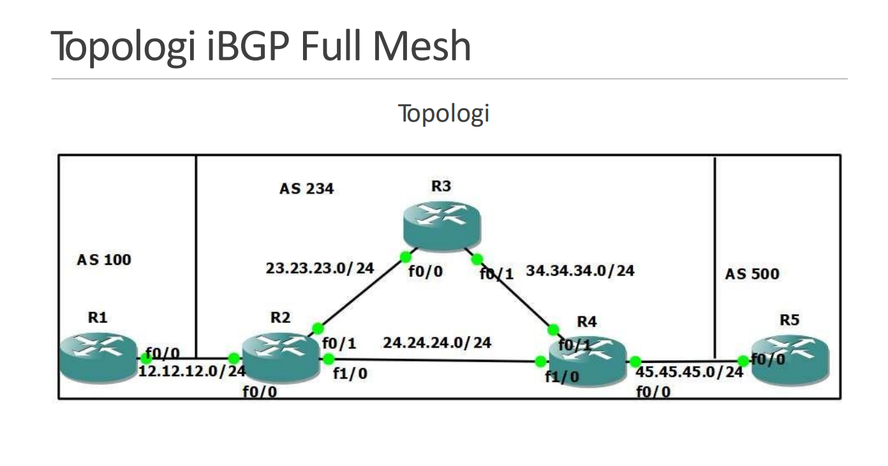
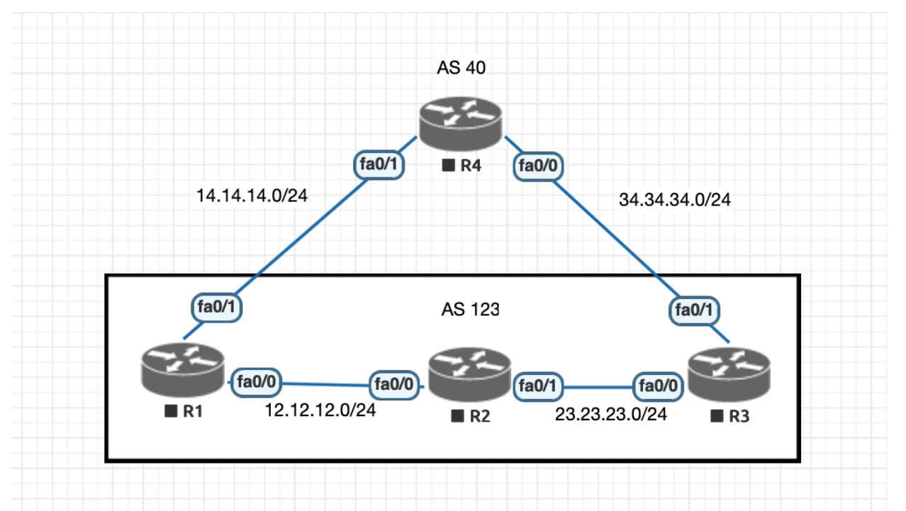

<a href="../../README.md#back">Back README.md...</a>

# bgp
## pengenalan
- Border Gateway Protocol (BGP)
    - BGP adalah protokol routing yang digunakan di Internet untuk mengelola lalu lintas di antara jaringan atau Autonomous System (AS). 
    - Tujuannya adalah untuk memberikan informasi kepada router tentang jalur terbaik untuk mencapai tujuan tertentu di seluruh Internet.
- Cara kerja dari BGP adalah dengan menterjemahkan sebuah IP network menggunakan path vector, untuk selanjutnya tabel routing dikirim ke setiap neighbor yang kemudian melalui notifikasi dan pemberitahuan melakukan update tabel routing secara otomatis. 
    - Jika perubahan muncul dan mempengaruhi banyak path, maka secara masif notifikasi perubahan dikirim ke setiap neighbor.

### AS
- AS adalah kelompok jaringan yang diadministrasikan oleh satu organisasi atau penyedia layanan internet. Setiap AS memiliki nomor AS unik yang digunakan untuk mengidentifikasinya di Internet.

### bgp peering
- BGP Peering adalah koneksi antara dua router BGP, baik di dalam satu AS (iBGP) atau antar AS yang berbeda (eBGP). Router yang terhubung pertukaran informasi BGP dan membuat keputusan tentang jalur terbaik.

### bgp update
- Router BGP bertukar pesan “update” untuk menginformasikan satu sama lain tentang jalur ke berbagai tujuan. Pesan update mengandung informasi seperti prefix (blok alamat IP), nomor AS yang bertanggung jawab, dan atribut jalur lainnya.

# configuration
## bgp
```
Router(config)#router bgp<AS 1-65535>
Router(config-bgp)#neighbor <ip_nexthope> remote-as <AS>
Router(config-bgp)#neighbor <ip_nexhope_lo1> remote-as <AS>
Router(config-bgp)#neighbor <ip_loppback> update-source Loopback1
Router(config-bgp)#neighbor <ip_nexthope> next-hop-self
Router(config-bgp)#default-information originate
Router(config-bgp)#redistribute connected
Router(config-bgp)#redistribute ospf 10

Router(config)#router ospf 10
Router(config-ospf)#redistribute connected
Router(config-ospf)#redistribute ospf 10
``` 
- router bgp (AS 1-65535) -> untuk menetapkan router ke dalam proses BGP dengan nomor AS sekian
- neighbor (IP-Address) remote-as (AS)-> untuk menetapkan router lain sebagai tetangga BGP
- redistribute connected-> untuk memberitahu router tetangga BGP tentang semua jaringan yang terhubung
- redistirbute ospf 10 / bgp 10 => distribusi network yang dimiliki ospf  / bgp ke bgp / ospf
- defaultl-informate originate
- neighbor <ip> update-source lo1 => jika ingin mendapatkan network yang ada pada nexhope dengan ip lo1

## show bgp
```
Router#show ip bgp
Router#show ip bgp neighbors
Router#show ip bgp summary
```

## contoh
```
(c)# router bgp 20
(c)# neighbor 10.10.10.1 remote-as 10 # ip next hope dan id neighbor
(c)# neighbor 20.20.20.2 remote-as 30
(c)# network 10.10.10.0 mask 255.255.255.0
(c)# network 20.20.20.0 mask 255.255.255.0
(c)# network 192.168.20.0 mask 255.255.255.0
```

# bgp with ospf
- topologi


- config
```
Router1(config)#int fa0/0
Router1(config-if)#ip add 12.12.12.1 255.255.255.0
Router1(config-if)#no shutdown
Router2(config)#int fa0/0
Router2(config-if)#ip add 12.12.12.2 255.255.255.0 
Router2(config-if)#no shutdown 
Router2(config)#int fa0/1
Router2(config-if)#ip add 23.23.23.1 255.255.255.0 
Router2(config-if)#no shutdown 
Router2(config)#int fa1/0
Router2(config-if)#ip add 24.24.24..1 255.255.255.0
Router2(config-if)#int lo0
Router2(config-if)#ip add 2.2.2.2 255.255.255.255
Router3(config)#int fa0/0
Router3(config-if)#ip add 23.23.23.2 255.255.255.0
Router3(config-if)#no shutdown
Router3(config)#int fa0/1
Router3(config-if)#ip add 34.34.34.1 255.255.255.0
Router3(config-if)#no shutdown
Router3(config-if)#int lo0
Router3(config-if)#ip add 3.3.3.3 255.255.255.255
Router4(config)#int fa0/0
Router4(config-if)#ip add 45.45.45.1 255.255.255.0 
Router4(config-if)#no shutdown
Router4(config)#int fa0/1
Router4(config-if)#ip add 34.34.34.2 255.255.255.0 
Router4(config-if)#no shutdown
Router4(config)#int fa1/0
Router4(config-if)#ip add 24.24.24.2 255.255.255.0 
Router4(config-if)#no shutdown
Router4(config-if)#int lo0
Router4(config-if)#ip add 4.4.4.4 255.255.255.255
Router5(config)#int fa0/0
Router5(config-if)#ip add 45.45.45.2 255.255.255.0 
Router5(config-if)#no shutdown
Router5(config-if)#int lo0
Router5(config-if)#ip add 5.5.5.5 255.255.255.255

R1(config)#router bgp 100
R1(config-router)#neighbor 12.12.12.2 remote-as 234
R1(config-router)#network 12.12.12.0 mask
255.255.255.0
R5(config)#router bgp 500
R5(config-router)#neighbor 45.45.45.1 remote-as 234
R5(config-router)#network 45.45.45.0 mask
255.255.255.0
R5(config-router)#network 5.5.5.5 mask
255.255.255.255
R2(config)#router ospf 10
R2(config-router)#network 2.2.2.2 0.0.0.0 area 0
R2(config-router)#network 23.23.23.0 0.0.0.255 area 0
R2(config-router)#network 24.24.24.0 0.0.0.255 area 0
R2(config)#router bgp 234
R2(config-if)#neighbor 3.3.3.3 remote-as 234
R2(config-if)#neighbor 4.4.4.4 remote-as 234
R2(config-if)#neighbor 12.12.12.1 remote-as 100
R3(config)#router ospf 10
R3(config-router)#network 23.23.23.0 0.0.0.255 area 0
R3(config-router)#network 34.34.34.0 0.0.0.255 area 0
R3(config-router)#network 3.3.3.3 0.0.0.0 area 0
R3(config-router)#router bgp 234
R3(config-router)#neighbor 2.2.2.2 remote-as 234
R3(config-router)#neighbor 4.4.4.4 remote-as 234
R4(config)#router ospf 10
R4(config-router)#network 24.24.24.0 0.0.0.255 area 0
R4(config-router)#network 34.34.34.0 0.0.0.255 area 0
R4(config-router)#network 4.4.4.4 0.0.0.0 area 0
R4(config-router)#router bgp 234
R4(config-router)#neighbor 2.2.2.2 remote-as 234
R4(config-router)#neighbor 3.3.3.3 remote-as 234
R4(config-router)#neighbor 45.45.45.2 remote-as 500

dan taambahkan redisbrute conected, ospf 10, bgp nya juga
lalu tamabahkan update-source lo1 di R2 dan R4 ke ip lo1 tujuan
```

# bgp best path selection
```
1. Weight tertinggi
2. Local Preference tertinggi
3. Locally originate
4. AS path terpendek
5. IGP > EGP > incomplete
6. MED terkecil
7. eBGP > iBGP
8. Metrik IGP terkecil
9. Prefix terlama
10.path dengan router-id terkecil
11.path dengan cluster list 
minimal
12.Path dengan neighbor address 
terkecil
```

## weight
- Weight merupakan parameter spesifik Cisco
- Nilai Weight hanya di perbandingkan pada lokal router, sehingg setelah melewati router parameter Weight tidak dibawa
- Weight banyak dipakai untuk memprioritaskan path yang akan keluar dari router
- Nilai default dari Weight adalah 0 
- Semakin tinggi nilai Weight dari path makan semakin prioritas path tersebut pada satu router

## Local Preference
- Nilai Local Preference di pertukarkan pada iBGP peer
- Local preference merupakan atribut well-known Discretionary yang selalu di kenali oleh router merk lain jika dikonfigurasi
- Nilai default Local Preference adalah 100
- Semakin tinggi nilai Local Preference maka akan semakin prioritas path tersebut
- Nilai Local Preference tidak akan dibawa pada eBGP peer

## Locally Originate
- Prefer path yang berasal dari local dibandingkan path dari router neighbor
- Path lokal yang bersumber dari perintah network atau redistribute lebih dipilih dibandingkan dengan path yang bersumber dari perintah aggregate-address

## AS Path
- Path dengan AS Path terpendek lebih di prioritaskan
- AS path bisa ditambah (prepend) sehingga terlihat lebih Panjang dari pada AS path aslinya
- AS Path merupakan atribut well-known mandatory yang selalu di kenali oleh router merk lain yang menjalankan BGP

## Origin
- Origin merupakan atribut well-known mandatory yang selalu di kenali
oleh router merk lain yang menjalankan BGP
- Path yang berasal dari IGP lebih prefer dibandingkan dengan EGP, dan path yang berasal dari EGP lebih prefer dibandingkan denga redistribution (incomplete) (IGP > EGP > incomplete)
- Kode origin ‘i’ muncul jika prefix tersebut di masukan menggunakan perintah ‘network’ pada BGP. Sedangkan kode origin ‘?’ didapatkan pada saat redistribution prefix kedalam BGP
- Kode origin ‘e’ saat ini sudah tidak digunakan lagi, sehingga yang diperhatikan hanyalah IGP > incomplete

## med
- Path dengan MED terkecil lebih di prioritaskan
- MED bisa juga disebut dengan metrik BGP- MED merupakan atribut Optional Non-Transitive yang akan di drop jika tidak dikenali oleh perangkat tertentu
- Path yang tidak di konfigurasi dengan MED by default akan diberi nilai MED 0

- toplogi


- config weight
```
R1(config)#router bgp 123
R1(config-if)#neighbor 12.12.12.2 remote-as 123
R1(config-if)# neighbor 12.12.12.2 next-hop-self
R1(config-if)# neighbor 14.14.14.2 remote-as 40
R1(config-if)# network 12.12.12.0 mask 255.255.255.0
R2(config)#router bgp 123
R2(config-if)#neighbor 12.12.12.1 remote-as 123
R2(config-if)#neighbor 12.12.12.1 route-reflector-client
R2(config-if)#neighbor 23.23.23.2 remote-as 123
R2(config-if)#neighbor 23.23.23.2 route-reflector-client
R3(config)#router bgp 123
R3(config-if)#neighbor 23.23.23.1 remote-as 123
R3(config-if)#neighbor 23.23.23.1 next-hop-self
R3(config-if)#neighbor 34.34.34.2 remote-as 40
R3(config-if)#neiwork 23.23.23.0 mask 255.255.255.0
R3(config-if)#network 34.34.34.0 mask 255.255.255.
R4(config)#router bgp 40
R4(config-if)#neighbor 14.14.14.1 remote-as 123
R4(config-if)# neighbor 34.34.34.1 remote-as 123
R4(config-if)# network 4.4.4.4 mask 255.255.255.255

R2(config)#access-list 1 permit 4.4.4.4
R2(config)#route-map WEIGHT permit 10
R2(config-route-map)#match ip address 1
R2(config-route-map)#set weight 200
R2(config)#router bgp 123
R2(config-if)#neighbor 23.23.23.2 route-map WEIGHT in
```

- config 