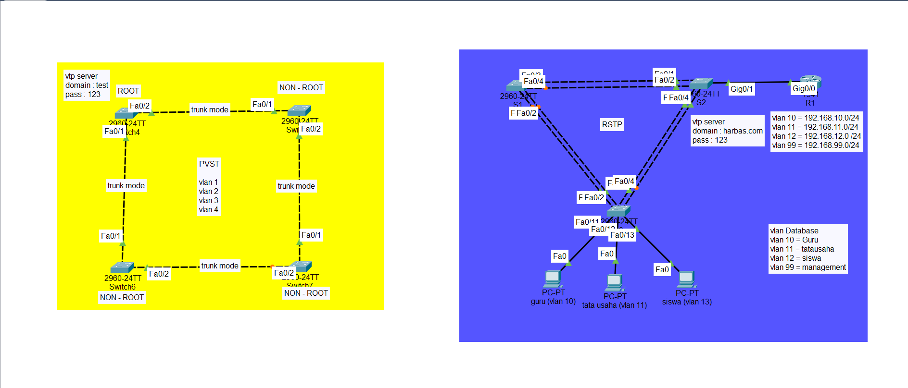

<a href="../../README.md#back">Back README.md...</a>

# pvst rpvts
## pengenalan
- PVST => (Per VLAN Spanning-Tree). 
    - PVST adalah varian dari STP yang memungkinkan setiap VLAN di jaringan untuk menjalankan instance STP yang terpisah. Ini berarti setiap VLAN memiliki pohon spanning tree sendiri.
    - fitur
        - Instance Terpisah: Setiap VLAN memiliki topologi spanning tree yang berbeda.
        - Load Balancing: Dapat melakukan load balancing lalu lintas jaringan dengan menggunakan jalur yang berbeda untuk VLAN yang berbeda.
        - Isolasi Masalah: Masalah pada satu VLAN tidak mempengaruhi VLAN lain.

- RPVST => (Rapid Per-VLAN Spanning Tree)
    - RPVST adalah varian dari RSTP yang memungkinkan setiap VLAN di jaringan untuk menjalankan instance RSTP yang terpisah. 
    - Ini memberikan keuntungan dari waktu konvergensi yang cepat serta fleksibilitas pengelolaan VLAN seperti pada PVST.
    - fitur
        - Konvergensi Cepat: Menggunakan mekanisme RSTP untuk konvergensi yang lebih cepat (dalam hitungan milidetik hingga detik).
        - Instance Terpisah: Setiap VLAN memiliki instance RSTP yang terpisah.
        - Load Balancing: Sama seperti PVST, RPVST memungkinkan load balancing melalui VLAN yang berbeda.

## diference
Base/Critrea | STP | PVST | RSTP | RPVST | MSTP
--- | --- | --- | --- | --- | --- |
Developer/creator | IEEE | Cisco | IEEE	| Cisco | IEEE
Standard | Open-Standard | Proprietary | Open-Standard | Proprietary | Open-Standard
Support VLAN | No | Yes | No | Yes | Yes
Instance | One per switch | One Per VLAN | One per switch | One Per VLAN | One Per VLAN
Support PortFast | No | Yes | No | Yes | No
Support EtherChannel | No | Yes | No | Yes | No
Runs on | All switches | Only on Cisco switches | All switches | Only on Cisco switches | All switches
Convergence	| Slow | moderate | fast | Fast | Fast | Fast

## kesimpulan
- PVST cocok untuk jaringan yang memerlukan topologi spanning tree yang terpisah untuk setiap VLAN dan tidak terlalu mempermasalahkan waktu konvergensi.
- RPVST cocok untuk jaringan yang memerlukan konvergensi cepat dan fleksibilitas pengelolaan VLAN yang serupa dengan PVST.

# configuration
## toplogi


## PVST
```sh
int ra fa 0/1-2
sw mode tr
sw trunk allowed vlan 1-4

spanning-tree mode pvst # default
spanning-tree vlan 1-4

spanning-tree vlan 1-4 root primary
# sp vl 1 pri 0; sp vl 2 pri 0; ...
``

## RPVST
```bash
spanning-tree vlan 10 priority 4096 # ke semua vlan
spanning-tree mode rapid-pvst 
```

## show
```
# show spanning-tree [summary | detail | root]
# show spanning-tree [interface | vlan]
# show spanning-tree mst […]
```

# configuration doc
## pvst
```sh
spanning-tree mode {pvst | rapid-pvst}

! Bridge priority
spanning-tree vlan 1-4094 priority 32768

! Timers, in seconds
spanning-tree vlan 1-4094 hello-time 2
spanning-tree vlan 1-4094 forward-time 15
spanning-tree vlan 1-4094 max-age 20

! PVST+ Enhancements
spanning-tree backbonefast
spanning-tree uplinkfast

! Interface attributes
interface FastEthernet0/1
spanning-tree [vlan 1-4094] port-priority 128
spanning-tree [vlan 1-4094] cost 19

! Manual link type specification
spanning-tree link-type {point-to-point | shared}

! Enables PortFast if running PVST+, or
! designates an edge port under RPVST+
spanning-tree portfast

! Spanning tree protection
spanning-tree guard {loop | root | none}

! Per-interface toggling
spanning-tree bpduguard enable
spanning-tree bpdufilter enable
```

## mst 
```sh
spanning-tree mode mst

! MST Configuration
spanning-tree mst configuration
name MyTree
revision 1

! Map VLANs to instances
instance 1 vlan 20, 30
instance 2 vlan 40, 50

! Bridge priority (per instance)
spanning-tree mst 1 priority 32768

! Timers, in seconds
spanning-tree mst hello-time 2
spanning-tree mst forward-time 15
spanning-tree mst max-age 20

! Maximum hops for BPDUs
spanning-tree mst max-hops 20

! Interface attributes
interface FastEthernet0/1
spanning-tree mst 1 port-priority 128
spanning-tree mst 1 cost 19
```


