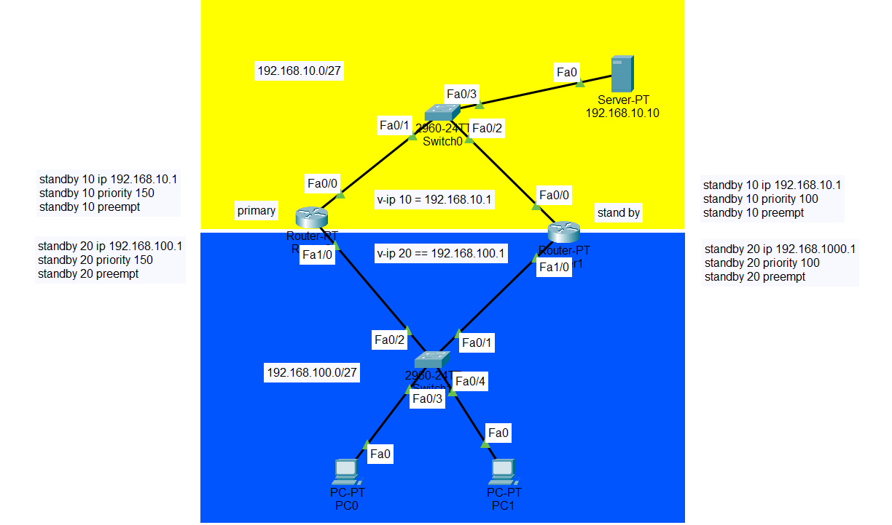

<a href="../../README.md#back">Back README.md...</a>

# HSRP
## pengenalan
- HSRP adalah sebuah protokol standar CISCO yang menetapkan sebuah router yang secara otomatis mengambil alih jika router yang lain gagal. 
    - Dalam HSRP disetting dua status router yaitu aktif dan standby. Router standby baru digunakan jika router aktifnya gagal.
    - Gateway Load Balacing Protocol (GLBP) sendiri sama tujuannya dengan HSRP yaitu sebuah protokol yang melindungi trafik data, jika salah satu router gagal. GLBP membagi paket yang akan dikirimkan menggunakan prinsip load balancing.
    - Load balancing adalah sebuah konsep yang gunanya untuk menyeimbangkan beban atau muatan paket yang akan dikirimkan melalui routerrouter yang aktif.

- High Availibility => digunakan dengan maksud redundancy yaitu sebagai menggunakan beberapa router, 
    - yang satu menjadi link utama dan yang lain sebagai backup. 
    - Satu virtual gateway akan dipasang di PC local sehingga ketika pindah router tidak perlu mengeset gateway lagi.
    - terdapat 2 status gateway aktif dan gateway staandby

# configuration
## hsrp
```bash
int fa 0/1

standby <id> ip <virtual_ip>
standby <id> priority <priority> # semakin besaar prioeity maka kan menjadi primary
standby <id> preempt

standby <id> track fa0/0
```

## contoh
```bash
int fa 0/1

standby 10 ip 192.168.10.1
standby 10 priority 100
standby 10 preempt
```


## show
```bash
show standby br
```

```bash
interface FastEthernet0/0
ip address 10.0.1.2 255.255.255.0
standby version {1 | 2}
standby 1 ip 10.0.1.1
standby 1 timers <hello> <dead>
standby 1 priority <priority>
standby 1 preempt
standby 1 authentication md5 key-string <password>
standby 1 track <interface> <value>
standby 1 track <object> decrement <value>
```