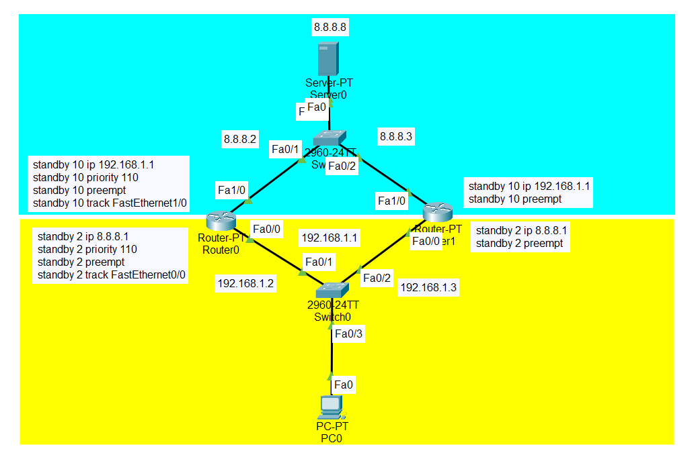

# FHRP
- FHRP => First Hop Redundancy Protocols
    - HSRP
    - VRRP
    - GLBP
- Addressing
    - virtual IP
    - virtual MAC
- failover
- tracking

# HSRP
## pengenalan
- HSRP adalah sebuah protokol standar CISCO yang menetapkan sebuah router yang secara otomatis mengambil alih jika router yang lain gagal. 
    - Dalam HSRP disetting dua status router yaitu aktif dan standby. Router standby baru digunakan jika router aktifnya gagal.
    - Gateway Load Balacing Protocol (GLBP) sendiri sama tujuannya dengan HSRP yaitu sebuah protokol yang melindungi trafik data, jika salah satu router gagal. GLBP membagi paket yang akan dikirimkan menggunakan prinsip load balancing.
    - Load balancing adalah sebuah konsep yang gunanya untuk menyeimbangkan beban atau muatan paket yang akan dikirimkan melalui routerrouter yang aktif.

- High Availibility => digunakan dengan maksud redundancy yaitu sebagai menggunakan beberapa router, 
    - yang satu menjadi link utama dan yang lain sebagai backup. 
    - Satu virtual gateway akan dipasang di PC local sehingga ketika pindah router tidak perlu mengeset gateway lagi.
    - terdapat 2 status gateway aktif dan gateway staandby

- default angka priority dari hsrp adalah 100
    - jika salah satu ethernet mati maka cost akan turun menjadi 50
    - jadi jika ada 120 dan 100 daan ketika router 120 itu ethehr nya ada yang mati akan menjadi sisa 60 dan akan menjadi priority yaitu router 100 # defaultnya 5

- mac => 0000:0c07:acxx => xx adaalah GRP number
- hello timer 3 detik
- hello hold 10 detik

## perbedaan

| Basis of Comparison | VRRP | HSRP | GLBP |
|:---:|:---:|:---:|:---:|
| Standard   | Open IEEE Standard | Cisco’s Proprietary Protocol | Cisco’s Proprietary Protocol |
| First Hop Redundancy Protocol  | FHRP | FHRP | FHRP |
| Timers  | Default Hello – 1 Sec Hold Time – counted automatically and can’t be configured. | Default Hold/Dead Time – 10 Secs  Default Hello – 3 Secs | Default Hold/DeadTime – 10 Secs |
| RFC    | 5798 | 2281 | No RFC |
| IPv6 | No support for IPv6 on the original VRRP, VRRPv3 now supports it. | Supports IPv6 | Supports IPv6 |
| Virtual IP | Virtual IP could be the same as physical IP | Configure separate IP for the Virtual. | Configure separate IP for the Virtual. |
| Preemption  | Enabled by default | Not enabled by default |   It is not enabled by default for AVGs. |
| Router Roles   | It follows the concept of master and backup router  roles | Its router roles are – Active and Standby GLBP | Router roles like – AVG, AVF and AVS |
| Load Balancing |  Not Supported – Sharing can be done by configuring  single subnet/Interface of multiple groups. | Load Balancing not Supported – Sharing can be done for the cause . | Load Balancing Supported -3 Load Balancing Schemes  like Round-Robin (Default), Weighted, and Host-Dependent |
| Virtual MAC Address  |  0000.5e00.01xx – here XX is the VRRP group number in hex  |  0000.0c07.acXX – here XX is the HSRP group number in HEX | 0007.b4XX.XXYY here XX.XX = 6 zero bits(empty) and 10 bits for the Group number. |
| Sample Configuration | > ip address ip-address mask > vrrp group-description text | > standby-[group]-ip {virtual-ip} > standby-[group]-timers {hello} | > glbp-group-ip [ip-address [secondary] |

# configuration
## hsrp
```bash
int fa 0/1

standby <id> ip <virtual_ip>
standby <id> priority <priority> # semakin besaar prioeity maka kan menjadi primary
standby <id> preempt

standby <id> track fa0/0
```

## contoh
```bash
int fa 0/1

standby 10 ip 192.168.10.1
standby 10 priority 100 # default 100 (perangkat yang aktif adalah perangkat yang memiliki priority tertinggi)
standby 10 preempt
stamdny 10 track fe0/2 50 # ketikaa fe 0/2 mati total priority yang ada pada fa 0/1 akan berkurang menjadi 50
# defaultnya berkurang 5
```



## show
```bash
show standby br
show track [brief]
```

```bash
interface FastEthernet0/0
ip address 10.0.1.2 255.255.255.0
standby version {1 | 2}
standby 1 ip 10.0.1.1
standby 1 timers <hello> <dead>
standby 1 priority <priority>
standby 1 preempt
standby 1 authentication md5 key-string <password>
standby 1 track <interface> <value>
standby 1 track <object> decrement <value>
```