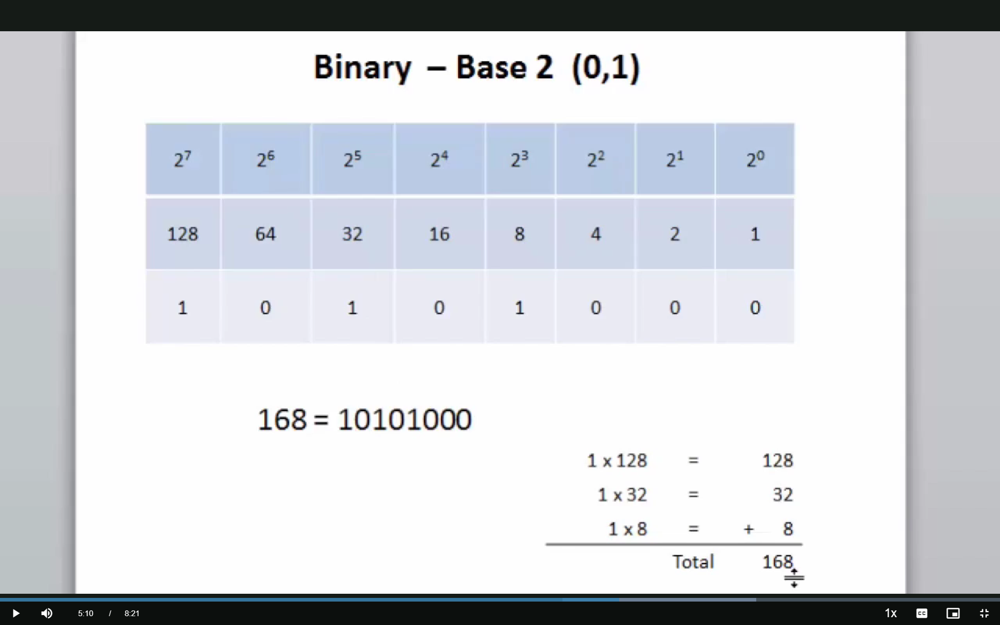
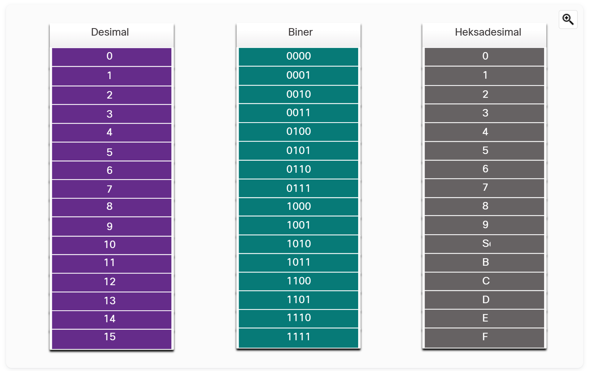

# desimal (base 10)
- 0,1,2,3,4,5,6,7,8,9

# binear (base 2)
- 0, 1
- example angka 168
    128 64 32 16 8 4 2 1
     1  0  1  0  1 0 0 0

hexadesimal (base 16)
- 0, 1, 2, 3, 4, 5, 6, 7, 8, 9, A, B, C, D, E, F, G
  - A = 10
  - B = 11
  - C = 12
  - D = 13
  - E = 14
  - F = 15

225 = 11100001 (desimal)
225 = 1110 | 0001
    = 8 4 2 1 | 8 4 2 1
    = 1 1 1 0 | 0 0 0 1
    = ------------------
    = 8 4 2 0 | 0 0 0 1
    = 14 | 1
res = E1 (hexadesimal)
