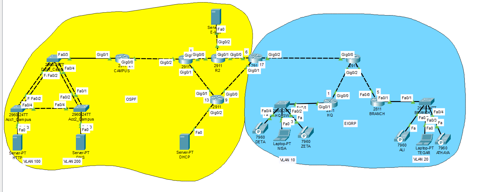

## E-Time Network Competition - Troubleshooting Challenge
### Topology

Anda sebagai network engineer ditugaskan untuk membenahi permasalahan jaringan yang terdapat pada soal troubleshooting ini. Setiap permasalahan sudah dituangkan dalam bentuk laporan ticket. Berusahalah memperbaiki setiap ticket yang ada dan juga berikanlah laporan berupa solusi dari setiap ticket yang berhasil anda kerjakan !

### Soal
#### Ticket 1
Urgent!!!, layanan jaringan mengalami gangguan pada R1. gangguan mengakibatkan semua karyawan di OFFICE baik HQ dan BRANCH komplain karena layanan akses menuju jaringan CAMPUS unreachable atau tidak bisa diakses sama sekali. Segera ambil tindakan agar jaringan kembali normal hingga semua router dapat terhubung dengan baik.

#### Ticket 2
Layanan server DNS mengalami masalah tidak bisa diakses atau di reachable, setelah coba dilakukan test ping dari laptop Tegar ke alamat Server DNS yaitu 192.168.200.200. Pesan yang tampil adalah “Request Time Out”, Sedangkan ke layanan server HTTP jika di test ping berjalan dengan baik tidak ada masalah. Selesaikan masalah ini karena semua layanan dapat terganggu jika Server DNS bermasalah.

#### Ticket 3
Kalau #Ticket 2 sudah berhasil ditangani artinya semua laptop client sudah bisa menggunakan layanan domain yang tersedia. Salah satunya adalah domain etime.pnj yang akan menampilkan laman web, namun setelah dicek layanan web browser tidak bisa diakses baik dengan menggunakan domain ataupun alamat ip server HTTP di 192.168.100.100. Pesan eror yang tampil ialah “Server Reset Connection”. Segera lakukan perbaikan pada layanan HTTP web agar bisa diakses oleh laptop client.

#### Ticket 4
Ada laporan di OFFICE, tepatnya di HQ. Laporannya adalah seluruh client dijaringan ini tidak mendapatkan alamat DHCP. Tolong segera tangani permasalahan ini agar semua client mendapatkan dhcp client dari layanan server DHCP.

#### Ticket 5
Info!!!, pada jaringan BRANCH terdapat layanan VoIP yang berjalan di router 2811. VoIP sudah bisa digunakan untuk komunikasi dari ALI ke ATHAYA. Namun pada jaringan HQ pada ip phone Deta dan Zeta belum bisa digunakan dengan baik. Tolong set up layanan VoIP pada router 2911 atau HQ agar Deta dan Zeta dapat berkomunikasi di number 1001 dan 1002.

### #Ticket 6
Setelah berhasil membangun layanan VoIP pada jaringan HQ. Ada permintaan dari atasan agar seluruh karyawan di OFFICE baik HQ dan BRANCH dapat berkomunikasi lewat ip phone yang tersedia. Tolong bantu setting VoIP agar Deta dapat menelpon Ali dan sebaliknya agar memudahkan komunikasi antar karyawan.

### #Ticket 7
Karyawan atas nama NISA minta dibuatkan akun email ke tim IT agar bisa mengirimkan berkas berkas kerjaannya ke karyawan atas nama TEGAR. Saat ini yang sudah memiliki akun email hanya karyawan TEGAR. Segera buatkan dan setup dilaptopnya dengan nama user nisa dan password 123

#### Ticket 8
Dapat informasi katanya boss ingin melakukan audit dari penerapan jaringan di CAMPUS network agar dapat dievaluasi dan ditingkatkan dikemudian hari. Jadi tugas kamu laporkan yang kamu temui seluruh konfigurasi yang ada di jaringan CAMPUS baik router, switch dan server !!!

---

### Jawaban
#### ✅ Ticket 1 - Akses Jaringan CAMPUS Unreachable

**Masalah:** Router R1 tidak bisa mengakses CAMPUS
**Solusi:** Tambahkan network yang kurang di OSPF router R1

```
router ospf 10
 network 10.10.10.20 0.0.0.3 area 0
```

#### ip address pada interface gig 0/1 salah
```
interface GigabitEthernet0/1
 ip address 10.10.10.14 255.255.255.252
```

#### ✅ Ticket 2 - DNS Server Tidak Bisa Diakses

**Masalah:** Ping ke 192.168.200.200 timeout
**Solusi:** Di switch DSW\_Campus, tambahkan VLAN 200 pada trunk

```
switchport trunk allowed vlan 100,200
```

#### ✅ Ticket 3 - HTTP Tidak Bisa Diakses

**Masalah:** Web Server tidak bisa diakses meski DNS sudah bisa
**Solusi:** Aktifkan HTTP dan HTTPS di Server-PT (tab Services > HTTP > ON)

#### ✅ Ticket 4 - Client Tidak Dapat IP DHCP

**Masalah:** Client di HQ tidak dapat IP
**Solusi:** IP helper-address salah di subinterface router HQ

```
interface g0/1.10
 ip helper-address 172.16.10.2 ! (pastikan ini IP DHCP server)
```

#### ✅ Ticket 5 - VoIP HQ Tidak Berfungsi

**Masalah:** IP Phone Deta & Zeta tidak bisa telepon
**Solusi:**

* Aktifkan lisensi VoIP:

```
license boot module c2900 technology-package uck9
```

* Konfigurasi telephony:

```
telephony-service
 max-ephones 5
 max-dn 5
 ip source-address 192.168.10.1 port 2000
 auto assign 1 to 5
!
ephone-dn 1
 number 1001
!
ephone-dn 2
 number 1002
!
```

#### ✅ Ticket 6 - Komunikasi VoIP HQ dan BRANCH

**Masalah:** Deta tidak bisa nelpon Ali, sebaliknya juga tidak bisa
**Solusi:** Aktifkan dial-peer voice di kedua router

#### Router HQ
```
dial-peer voice 1 voip
 destination-pattern 200*
 session target ipv4:192.168.20.1
```

#### Router Branch
```
dial-peer voice 1 voip
 destination-pattern 100*
 session target ipv4:192.168.10.1
```

#### ✅ Ticket 7 - Buatkan Akun Email untuk NISA

**Solusi:**

* Tambahkan user di Email Server:

  * Username: nisa
  * Password: 123
* Setup di Laptop-PT NISA:

  * Display Name: NISA
  * Email Address: [nisa@mail.etime.pnj](mailto:nisa@mail.etime.pnj)
  * Incoming/Outgoing Server: mail.etime.pnj
  * Username: nisa
  * Password: 123

#### ✅ Ticket 8 - Audit Jaringan CAMPUS

**Solusi:** Dokumentasi konfigurasi sebagai berikut:

**Server:**

* DNS: 192.168.200.200 (zone etime.pnj A record ke HTTP, zone mail.etime.pnj A record ke mail server)
* HTTP: 192.168.100.100 (aktif HTTP/HTTPS)
* DHCP: 172.16.10.2 (IP helper digunakan di HQ)
* Mail: 172.16.20.2 (user: tegar, nisa)
