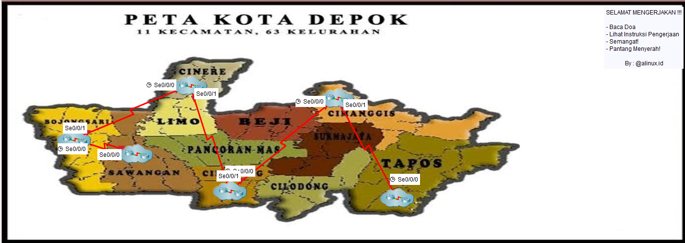
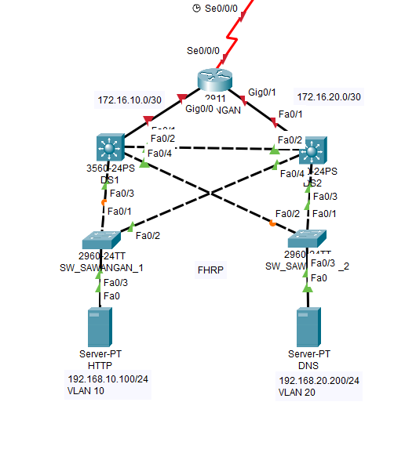
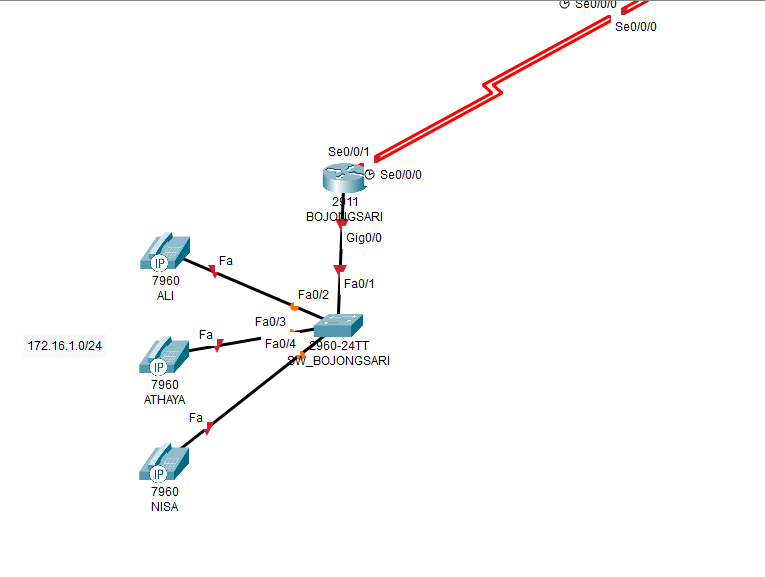
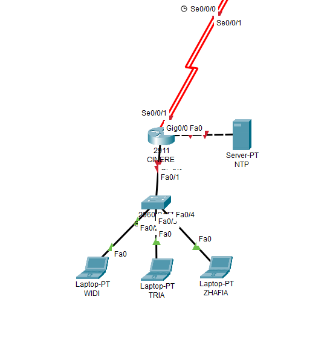
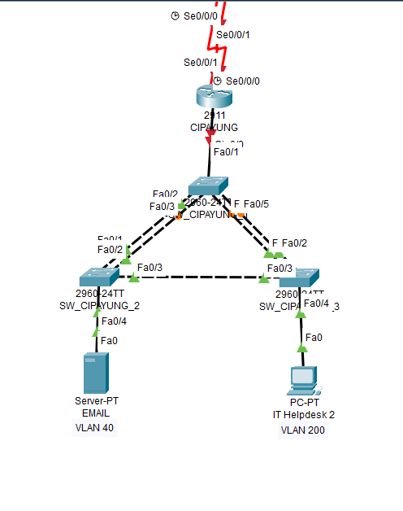
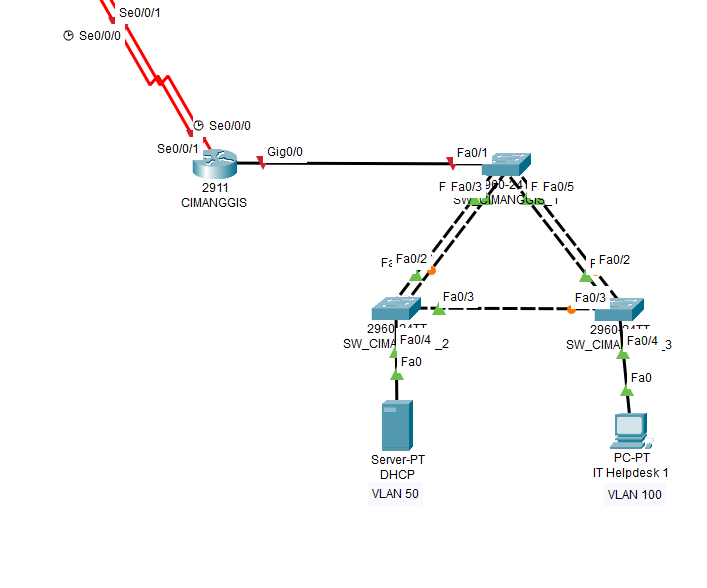
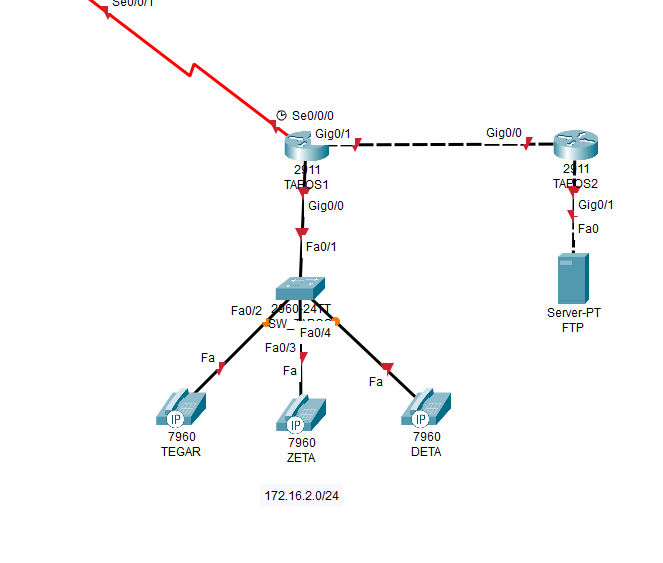

## E-Time Network Competition 2022 Final - Full Configuration
### Topology

Topologi Sawangan

Topologi Bojongsari

Topologi Cinere

Topologi Cipayung

Topologi Cimanggis

Topologi Tapos

---

### Soal
#### 1. IP Address Loopback
| Node       | IP Address | Subnet Mask     |
| ---------- | ---------- | --------------- |
| DS1        | 1.1.1.1    | 255.255.255.255 |
| DS2        | 2.2.2.2    | 255.255.255.255 |
| SAWANGAN   | 3.3.3.3    | 255.255.255.255 |
| BOJONGSARI | 4.4.4.4    | 255.255.255.255 |
| CINERE     | 5.5.5.5    | 255.255.255.255 |
| CIPAYUNG   | 6.6.6.6    | 255.255.255.255 |
| CIMANGGIS  | 7.7.7.7    | 255.255.255.255 |
| TAPOS1     | 8.8.8.8    | 255.255.255.255 |
| TAPOS2     | 9.9.9.9    | 255.255.255.255 |

#### 2. Konfigurasi Router & Switch
##### Router SAWANGAN
| IP Address     | Interface | Routing | ID | Area |
| -------------- | --------- | ------- | -- | ---- |
| 10.10.10.1/30  | Se0/0/0   | OSPF    | 10 | 0    |
| 172.16.10.1/30 | Gig0/0    | OSPF    | 10 | 0    |
| 172.16.20.1/30 | Gig0/1    | OSPF    | 10 | 0    |

##### SW L3 DS1
| IP Address     | Interface | Routing | ID | Area |
| -------------- | --------- | ------- | -- | ---- |
| 172.16.10.2/30 | Fa0/1     | OSPF    | 10 | 0    |
| 192.168.10.10  | VLAN10    | OSPF    | 10 | 0    |
| 192.168.20.20  | VLAN20    | OSPF    | 10 | 0    |

##### SW L3 DS2
| IP Address     | Interface | Routing | ID | Area |
| -------------- | --------- | ------- | -- | ---- |
| 172.16.20.2/30 | Fa0/1     | OSPF    | 10 | 0    |
| 192.168.10.11  | VLAN10    | OSPF    | 10 | 0    |
| 192.168.20.21  | VLAN20    | OSPF    | 10 | 0    |

##### Router BOJONGSARI
| IP Address    | Interface | Routing | AS | Area |
| ------------- | --------- | ------- | -- | ---- |
| 10.10.10.2/30 | Se0/0/0   | OSPF    | 10 | 0    |
| 10.10.10.5/30 | Se0/0/1   | OSPF    | 10 | 0    |
| 172.16.1.1/24 | Gig0/0    | OSPF    | 10 | 0    |

##### Router CINERE
| IP Address     | Interface | Routing | AS | Area |
| -------------- | --------- | ------- | -- | ---- |
| 10.10.10.6/30  | Se0/0/0   | OSPF    | 10 | 0    |
| 10.10.10.9/30  | Se0/0/1   | OSPF    | 10 | 0    |
| 192.168.1.1/24 | Gig0/1    | OSPF    | 10 | 0    |

##### Router CIPAYUNG
| IP Address       | Interface  | Routing | ID | Area | AS  |
| ---------------- | ---------- | ------- | -- | ---- | --- |
| 10.10.10.10/30   | Se0/0/0    | OSPF    | 10 | 0    | -   |
| 192.168.40.1/24  | Gig0/0.40  | OSPF    | 10 | 0    | -   |
| 200.200.200.1/24 | Gig0/0.200 | OSPF    | 10 | 0    | -   |
| 10.10.10.13/30   | Se0/0/1    | EIGRP   | -  | -    | 100 |

##### Router CIMANGGIS
| IP Address       | Interface  | Routing | AS  |
| ---------------- | ---------- | ------- | --- |
| 10.10.10.14/30   | Se0/0/0    | EIGRP   | 100 |
| 10.10.10.17/30   | Se0/0/1    | EIGRP   | 100 |
| 192.168.50.1/24  | Gig0/0.50  | EIGRP   | 100 |
| 100.100.100.1/24 | Gig0/0.100 | EIGRP   | 100 |

##### Router TAPOS
| IP Address     | Interface  | Routing | AS  |
| -------------- | ---------- | ------- | --- |
| 10.10.10.18/30 | Se0/0/0    | EIGRP   | 100 |
| 172.16.2.1/24  | Gig0/0     | EIGRP   | 100 |
| 80.80.80.1/24  | Gig0/0.100 | EIGRP   | 100 |

#### 3. Konfigurasi IP dan Layanan
##### Tabel IP Wilayah dan Fungsional
| No | Wilayah   | Fungsional | IP Address        |
| -- | --------- | ---------- | ----------------- |
| 1  | SAWANGAN  | HTTP       | 192.168.10.100/24 |
| 2  | SAWANGAN  | DNS        | 192.168.20.200/24 |
| 3  | CINERE    | NTP        | 192.168.30.30/24  |
| 4  | CIPAYUNG  | EMAIL      | 192.168.40.40/24  |
| 5  | CIMANGGIS | DHCP       | 192.168.50.50/24  |
| 6  | TAPOS     | FTP        | 192.168.60.60/24  |

##### List IP DHCP
| No | Name             | Start IP        | DNS            | TFTP       |
| -- | ---------------- | --------------- | -------------- | ---------- |
| 1  | Helpdesk1        | 100.100.100.100 | 192.168.20.200 | -          |
| 2  | Helpdesk2        | 200.200.200.200 | 192.168.20.200 | -          |
| 3  | VOIP\_TAPOS      | 172.16.2.2      | 192.168.20.200 | 172.16.2.1 |
| 4  | VOIP\_BOJONGSARI | 172.16.1.2      | 192.168.20.200 | 172.16.1.1 |
| 5  | CINERE           | 192.168.1.10    | 192.168.20.200 | -          |

##### List DNS
| No | DNS            | Type     | IP Address     |
| -- | -------------- | -------- | -------------- |
| 1  | etime.pnj      | A Record | 192.168.10.100 |
| 2  | mail.etime.pnj | A Record | 192.168.40.40  |

##### List E-Mail
| No | User  | Password | E-Mail                                              | PC            |
| -- | ----- | -------- | --------------------------------------------------- | ------------- |
| 1  | NISA  | 123      | [nisa@mail.etime.pnj](mailto:nisa@mail.etime.pnj)   | IT Helpdesk 1 |
| 2  | TEGAR | 123      | [tegar@mail.etime.pnj](mailto:tegar@mail.etime.pnj) | IT Helpdesk 2 |

##### VoIP BOJONGSARI
| No | User   | Type          | Number |
| -- | ------ | ------------- | ------ |
| 1  | ALI    | IP PHONE 7960 | 1001   |
| 2  | ATHAYA | IP PHONE 7960 | 1002   |
| 3  | NISA   | IP PHONE 7960 | 1003   |

##### VoIP TAPOS
| No | User  | Type          | Number |
| -- | ----- | ------------- | ------ |
| 1  | TEGAR | IP PHONE 7960 | 2001   |
| 2  | ZETA  | IP PHONE 7960 | 2002   |
| 3  | DETA  | IP PHONE 7960 | 2003   |

##### Access List FTP (Hanya Helpdesk Akses FTP)
| No | Wilayah | Protocol | Status | Source    | Destination |
| -- | ------- | -------- | ------ | --------- | ----------- |
| 1  | TAPOS2  | IP       | PERMIT | Helpdesk1 | Server FTP  |
| 2  | TAPOS2  | IP       | PERMIT | Helpdesk2 | Server FTP  |
| 3  | TAPOS2  | EIGRP    | PERMIT | ANY       | ANY         |
| 4  | TAPOS2  | IP       | DENY   | ANY       | ANY         |

#### 4. Berikut Point Point Pengerjaan
1. Setiap Server Disetting IP Secara Statik
2. SW L3 DS1 Menjalankan HSRP Pada VLAN 10 dengan group number 110 dan nilai priority 110 dan DS2 Menjadi Backup dengan group number 105
3. SW L3 DS2 Menjalankan HSRP Pada VLAN 20 dengan group number 120 dan nilai priority 110 dan DS2 Menjadi Backup dengan group number 105
4. Gateway yang digunakan oleh server HTTP ialah 192.168.10.1
5. Gateway yang digunakan oleh server DNS ialah 192.168.20.1
6. Setiap Router di setting untuk syncron time dan calendar ke NTP Server
7. Pada Server FTP di Tapos dibuatkan user dengan nama ali dan password 123 yang memiliki permission RWNL
8. Pada switch cipayung menjalankan spanning tree mode rapid pvst+ dengan ketentuan root bridge berada di SW_CIPAYUNG_1 baik vlan 40 dan 200
9. SW_CIPAYUNG_1 terdapat po1 mengarah SW_CIPAYUNG_2 dengan mode active
10. SW_CIPAYUNG_1 terdapat po2 mengarah SW_CIPAYUNG_3 dengan mode auto
11. SW_CIPAYUNG_2 terdapat po1 mengarah SW_CIPAYUNG_1 dengan mode passive
12. SW_CIPAYUNG_3 terdapat po1 mengarah SW_CIPAYUNG_1 dengan mode dessireble
13. Pada SW_CIMANGGIS_1 menjalankan spanning tree mode pvst dengan ketentuan root bridge berada di SW_CIMANGGIS_1 baik vlan 50 dan 100
14. SW_CIMANGGIS_1 terdapat po1 mengarah SW_CIMANGGIS_2 dengan mode active
15. SW_CIMANGGIS_1 terdapat po2 mengarah SW_CIMANGGIS_3 dengan mode auto
16. SW_CIMANGGIS_2 terdapat po1 mengarah SW_CIMANGGIS_1 dengan mode active
17. SW_CIMANGGIS_3 terdapat po1 mengarah SW_CIMANGGIS_1 dengan mode dessireble
18. Pada layanan VOIP Baik Bojongsari dan juga Tapos dapat berkomunikasi antar server VOIP
19. Pada layanan VOIP Baik Bojongsari dan juga Tapos ephone-dn berjumlah 5
20. Pada Router CIPAYUNG merupakan backbone router yang menjalankan resdistribusi routing

---

### Jawaban
