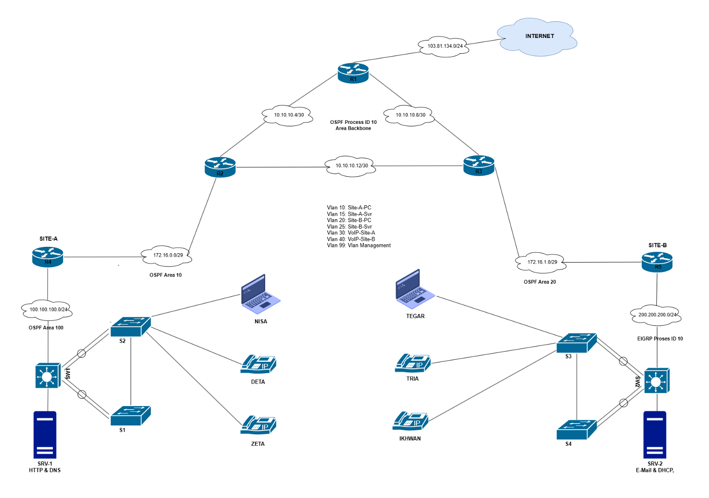
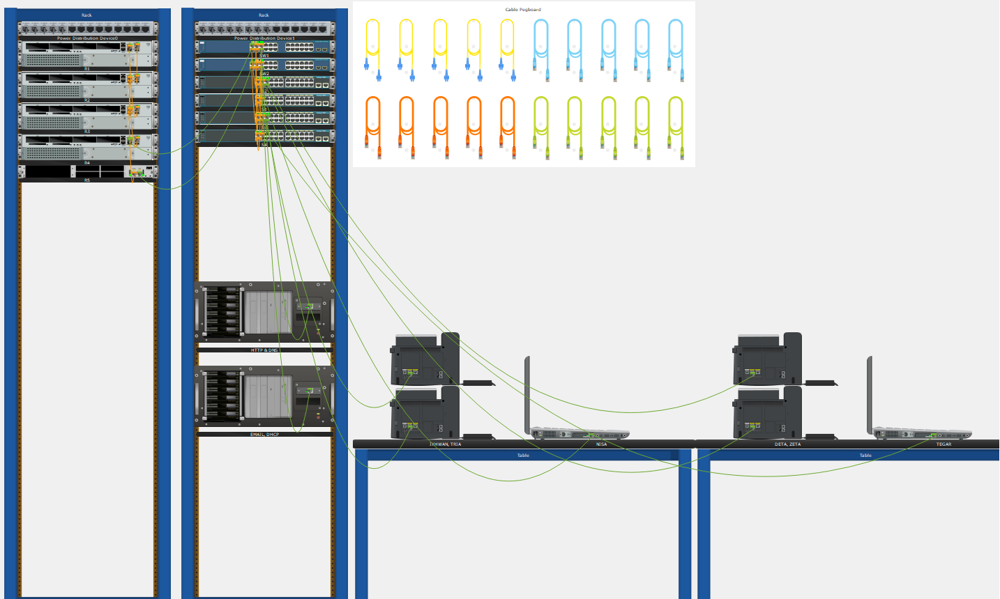
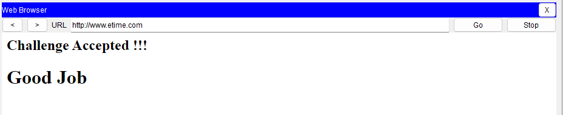

## E-Time Network Competition 2023 semifinal (0%) - Troubleshooting Challenge
### Topology
#### Logical View


#### Physical View


### SOAL
#### Description 
Kamu adalah seorang Network Engineer pada instansi E-Time dan memiliki akses masuk ke konsol perangkat jaringan seperti router, switch, firewall dan perangkat host seperti komputer server dan client. \
Jaringan pada instansi tersebut sedang mengalami banyak gangguan yang mengakibatkan proses pekerjaan terhambat, maka kamu diminta untuk  menyelesaikan setiap permasalahan yang terdapat pada jaringan di instansi E-Time dan menuliskan kedalam file POC setiap penyelesaian yang sudah dikerjakan. \
Semua masalah jaringan dapat dilihat pada fila pka  E-Time Troubleshooting Challenge dan juga pada lembar soal berikut. 

#### List Of Ticket
<details>
<summary>List Of Ticket</summary>

##### Ticket1 
Terdapat laporan bahwasanya router backbone di R2 dan R3 yang tidak bisa saling ping. Tolong diperbaiki! 

##### Ticket2 
Urgent!!, jaringan pada Site-A tidak berhasil terkoneksi ke jaringan ospf backbone, sehingga koneksi menjadi terganggung. Segera cari permasalahannya dan perbaiki! 

##### Ticket3 
Info!!, jaringan pada Site-B menggunakan routing protokol eigrp. Sedangkan pada Site-A menggunakan routing protokol ospf. Bantu agar kedua routing tersebut dapat saling terkoneksi. 

##### Ticket4 
Pada R1 merupakan router yang terkoneksi dengan ISP memberikan internet kepada semua client dibawahnya, maka anda sebagai network engineer diminta untuk menambahkan konfigurasi default route kearah internet! 

##### Ticke5 
Terjadi gangguan pada layanan etherchannel pada jaringan Site-B yang mengakibatkan jaringan protokol etherchannel tidak dapat berjalan. Mohon dicek dan diperbaiki! 

##### Ticket6
Tim support pada instansi etime ingin dapat mengakses perangkat router pada R1, R2 dan R3 secara remote dari laptop Tegar, buatkanlah akses remote tersebut dengan user tegar dan pass 123. 

##### Ticket7 
Terdapat komplen bahwasanya layanan web pada server http hanya dapat diakses menggunakan alamat ip server. Tolong buatkan domain agar mempermudah akses ke web. \
Domain yang dibuatkan untuk akses ke web yaitu etime.com dan www.etime.com dengan type A record dan juga CNAME. 

##### Ticket8 
Karyawan atas nama tegar minta dibuatkan akun email ke tim IT agar bisa mengirimkan berkas berkas kerjaannya ke karyawan atas nama nisa. Saat ini yang sudah memiliki akun email hanya karyawan nisa. \
Segera buatkan dan setup dilaptopnya dengan nama user tegar dengan password 123.

##### Ticket9  
Ada laporan pada IP Phone pada Site-B tidak dapat digunakan untuk menelpon antar pegawai Tria dan Ikhwan, cek kenapa bisa terjadi dan selesaikan agar bisa digunakan untuk menelpon antar pegawai pada Site-B! 

##### Ticket10 
Bos ingin layanan VoIP pada Site-A dan Site-B bisa terhubung satu sama lain agar komunikasi antar pegawai menjadi lebih mudah untuk dapat kordinasi antar site. coba kamu bantu konfigurasikan masalah ini tersolusikan. 

##### Ticket11
Lakukan audit jaringan dengan menuliskan semua service yang kamu temui kedalam file poc! 

</details>

#### ADDRESSING TABLE
<details>
<summary>ADDRESSING TABLE</summary>

### Tabel Konfigurasi Jaringan
#### Router dan Loopback
| Device | Interface | IP Address / Prefix | Default Gateway |
| ------ | --------- | ------------------- | --------------- |
| **R1** | GI0/0     | 10.10.10.5/30       | -               |
|        | GI0/1     | 10.10.10.9/30       | -               |
|        | Lo0       | 103.81.134.1/24     | -               |
| **R2** | GI0/0     | 10.10.10.6/30       | -               |
|        | GI0/1     | 10.10.10.13/30      | -               |
|        | GI0/2     | 172.16.0.1/29       | -               |
| **R3** | GI0/0     | 10.10.10.10/30      | -               |
|        | GI0/1     | 10.10.10.14/30      | -               |
|        | GI0/2     | 172.16.1.1/29       | -               |
| **R4** | GI0/0     | 172.16.0.2/29       | -               |
|        | GI0/1     | 100.100.100.1/24    | -               |
| **R5** | Fa0/0     | 172.16.1.2/29       | -               |
|        | Fa0/1     | 200.200.200.1/24    | -               |

#### Switch dan VLAN
| Device  | Interface | VLAN/Subnet     | Gateway      |
| ------- | --------- | --------------- | ------------ |
| **SW1** | Fa/1      | -               | -            |
|         | VLAN 10   | 192.168.1.0/24  | 192.168.1.1  |
|         | VLAN 15   | 192.168.10.0/28 | 192.168.10.1 |
|         | VLAN 30   | 192.168.3.0/24  | 192.168.3.1  |
| **SW2** | Fa/1      | -               | -            |
|         | VLAN 10   | 192.168.2.0/24  | 192.168.2.1  |
|         | VLAN 15   | 192.168.20.0/28 | 192.168.20.1 |
|         | VLAN 30   | 192.168.4.0/24  | 192.168.4.1  |

#### End Devices
| Host   | Interface | IP Address       | Default Gateway |
| ------ | --------- | ---------------- | --------------- |
| SRV-1  | Fa0       | 192.168.10.10/28 | 192.168.10.1    |
| SRV-2  | Fa0       | 192.168.20.10/28 | 192.168.20.1    |
| NISA   | Fa0       | 192.168.1.10/24  | 192.168.1.1     |
| TEGAR  | Fa0       | 192.168.2.10/24  | 192.168.2.1     |
| VoIP-A | Fa0       | 192.168.3.0/24   | 192.168.3.1     |
| VoIP-B | Fa0       | 192.168.4.0/24   | 192.168.4.1     |

</details>

### JAWABAN
#### Ticket 1
##### Router R2
```bash
int gig0/1
 ip add 10.10.10.13 255.255.255.252
```

#### Ticket 2
##### Router R4
```bash
router ospf 10
 area 10 virtual-link 172.16.0.1
```

##### Router R2
```bash
router ospf 10
area 10 virtual-link 172.16.0.2
```

#### Ticket 3
##### Router R5
```bash
router ospf 10
 redistribute eigrp 10 subnets 
router eigrp 10
 redistribute ospf 10
```

#### Ticket 4
##### Router R1
```bash
ip route 0.0.0.0 0.0.0.0 103.81.134.2
router ospf 10
 default-information ORiginate 
```

#### Ticket 5 (gak nambah njir persentasenya)
##### SW2
```bash
int ra fa 0/2-3
 channel-group 1 mode active 
```

##### S2
```bash
int port-channel 1
 sw mode tr
```

> masih ada maslaah antara SW2 ke R5 karena si pc tegar tidak bisa melakukan ping ke R5

#### Ticket 6 (gak nambah njir persentasenya)
##### Router R1, R2, R3
```bash
ip domain-name etime.pnj
crypto key generate rsa
! if want version 2 use 1024, if version 1 use 512

! only if u use rsa > 768
ip ssh version 2 

username tegar privilege 15 secret 123

line vty 0 15
 transport input ssh
 login local
```

##### verifikasi with PC NISA
```bash
ssh -l tegar 172.16.1.1
# pass 123
ssh -l tegar 172.16.0.1
# pass 123
ssh -l tegar 103.81.134.1
# pass 123
```

#### Ticket 7
##### HTTP & DNS (SERVER)
- add record
  - TYPE: A Record, Address: 192.168.10.10, name: etime.com
  - TYPE: CNAME Record, Host: etime.com, name: www.etime.com
  - TYPE: A Record, Address: 192.168.20.10, name: mail.etime.com
  - TYPE: CNAME Record, Host: etime.com, name: mail.etime.com



#### TIcket 8
##### EMAIL & DHCP (SERVER)
- add email user: tegar, pass: 123

##### PC TEGAR & PC NISA
- configurse email
  - NISA - nisa@mail.etime.com - mail.etime.com - nisa:123
  - TEGAR - tegar@mail.etime.com - mail.etime.com - tegar:123

---

#### Debug
```bash
# checkthe router id
show ip ospf 

clear ip ospf proc

sh eth sum
```