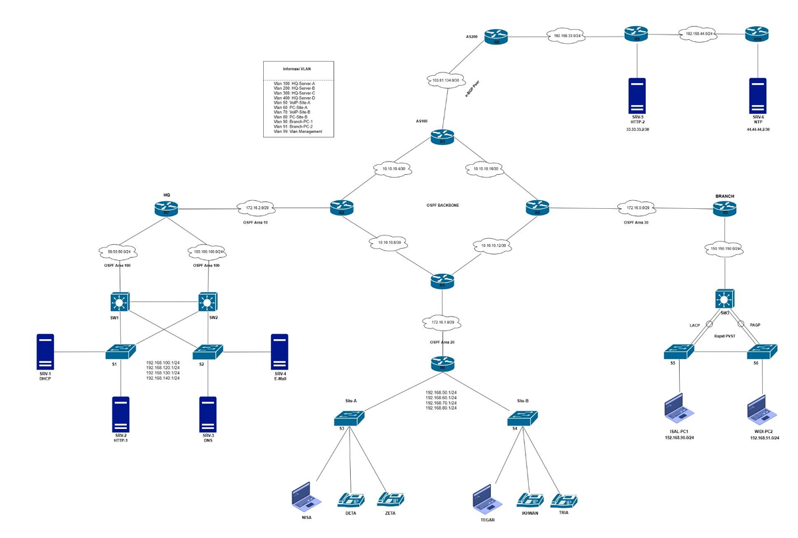

## E-Time Network Competition 2023 Final (85%) - Full Configuration
### Topology


### SOAL
#### Description 
Kamu adalah seorang Network Engineer pada instansi E-Time. Pada pekerjaan ini kamu ditugaskan untuk membangun jaringan beserta layanan jaringan untuk mendukung proses pekerjaan di instansi E-Time. \
Semua rancangan jaringan yang diminta sudah diberikan pada soal pka berikut ini. \
Selesaikan semua tugasmu agar instansi E-Time dapat segera beroperasi dengan jaringan yang memadai untuk semua pegawainya. \
Dalam melakukan konfigurasi kamu diberikan satu laptop config untuk dapat mengkonsol setiap perangkat jaringan.

#### Instructions
<details>
<summary>Instructions</summary>

1. Konfigurasikan alamat ip address sesuai yang tertera pada gambar soal topologi dan diperjelas
pada gambar file pka untuk menentukan alamat host id disetiap perangkat. Konfigurasikan pula
masing-masing nama hostname perangkat.
2. Konfigurasikan routing eBGP pada R8 dan R1. R1 menggunakan AS 100 dan R8 adalah 200.
3. Konfigurasikan ospf sesuai dengan yang diminta soal, diantaranya:
  - proses id 10
  - area yang digunakan adalah 0,10,20,30, dan 100
  - pada jaringan disisi Site-A dan Site-B dibuat untuk tidak perlu mendapatkan update database routing ospf untuk kearah client
  - konfigurasikan virtual link pada bagian router yang memiliki area 100
  - lakukan redistribute routing pada R1 menuju R8 begitu sebaliknya, dan R8 menuju R9 dan juga sebaliknya.
  - Pada saat konfigurasi routing ospf, router-id diset menggunakan ip loopback router masing masing dengan format angka yang berulang pada device name router, contoh R1: maka ip loopaback 1.1.1.1. Namun untuk Switch L3 ditambahkan satu angka dibelakang setelah nama device name. contoh SW1: maka ip loopback 11.11.11.11
  - advertise setiap network yang ada
4. Konfigurasikan etherchannel sesuai mode yang tertera pada gambar topologi, pada SW2 LACP menggunakan channel-group1 dan PAGP menggunakan channel-group 2
5. Konfigurasikan routing eigrp pada router R8, R9 hingga R10 dengan menggunakan as 10. Sama seperti ospf, routing eigrp menggunakan router-id dengan ketentuan yang sama.
6. Konfigurasikan vlan sesuai yang terdapat pada gambar topologi
7. Konfigurasikan stp rapid pvst pada jaringan switch bagian branch dimana S3 merupakan root primary dari vlan 90 dan root secondary dari vlan 91. Pada S4 sebaliknya, root primary vlan 91 dan secondari vlan 90.
8. Konfigurasikan HSRP pada bagian HQ SW1 dan SW2 dengan ketentuan sebagai berikut:
  - standby group number 110 yang menggunakan ip virtual 192.168.100.1 pada interface vlan100, nilai prioritas pada SW1 adalah 110 dan SW2 adalah 105, dan tambahkan command preempt.
  - standby group number 120 yang menggunakan ip virtual 192.168.120.1 pada interface vlan200, nilai prioritas pada SW1 adalah 110 dan SW2 adalah 105, dan tambahkan command preempt.
  - standby group number 130 yang menggunakan ip virtual 192.168.130.1 pada interface vlan300, nilai prioritas pada SW1 adalah 105 dan SW2 adalah 110, dan tambahkan command preempt.
  - standby group number 140 yang menggunakan ip virtual 192.168.140.1 pada interface vlan400, nilai prioritas pada SW1 adalah 105 dan SW2 adalah 110, dan tambahkan command preempt.
9. Konfigurasikan semua layanan server yang ada dengan benar, untuk layanan dns menggunakan type A record dengan 3 domain, yaitu: web1.etime.com, web2.etime.com dan mail.etime.com, untuk layanan email dibuat akun sebanyak seluruh client pc yang terdapat pada jaringan etime tersebut dengan pass 123, Untuk layanan dhcp diberikan untuk semua client host disetiap vlan, terkecuali perangkat server yang cukup diberikan ip static. Nama dhcp disesuaikan dengan nama vlan, dan untuk ip dhcp semua dimulai dengan angka 5. Layanan VoIP memiliku dua server, untuk Site A menggunakan R7 dan Site B menggunakan R5. Number yang digunakan adalah 001-005 pada R5 dan 2001-2005 pada R7, konfigurasikan sampai semua pegawai dapat saling call antar site.
10. Pada L2 Trunk SW1 memiliki 3 link, yang mengarah ke SW2 diperkenankan untuk melewati semua vlan, yang mengarah port fa0/2 hanya diperkenankan melewati vlan 100,200 dan yang mengarah port fa0/3 hanya diperkenankan melewati vlan 300, 400. Begitupun sebaliknya pada SW2.

</details>

---

### Jawaban 
#### A. BACKBHONE
##### R1
```bash
hostname R1
int lo0
 ip add 1.1.1.1 255.255.255.255
int gig0/0
 ip add 10.10.10.5 255.255.255.252
 no sh
int gig0/1
 ip add 10.10.10.18 255.255.255.252
 no sh
int gig0/2
 ip add 103.81.134.1 255.255.255.252
 no sh

router ospf 10
 router-id 1.1.1.1
 network 1.1.1.1 0.0.0.0 area 0
 network 10.10.10.4 0.0.0.3 area 0
 network 10.10.10.16 0.0.0.3 area 0
```

##### R2
```bash
hostname R2
int lo0
 ip add 2.2.2.2 255.255.255.255
int gig0/0
 ip add 10.10.10.6 255.255.255.252
 no sh
int gig0/1
 ip add 10.10.10.9 255.255.255.252
 no sh
int gig0/2
 ip add 172.16.2.1 255.255.255.248
 no sh

router ospf 10
 network 10.10.10.4 0.0.0.3 area 0
 network 10.10.10.8 0.0.0.3 area 0
 network 172.16.2.0 0.0.0.7 area 10
 area 10 virtual-link 7.7.7.7
```

##### R3
```bash
hostname R3
int lo0
 ip add 3.3.3.3 255.255.255.255
int gig0/0
 ip add 10.10.10.10 255.255.255.252
 no sh
int gig0/1
 ip add 10.10.10.13 255.255.255.252
 no sh
int gig0/2
 ip add 172.16.1.1 255.255.255.248
 no sh

router ospf 10
 network 10.10.10.8 0.0.0.3 area 0
 network 10.10.10.12 0.0.0.3 area 0
 network 172.16.1.0 0.0.0.7 area 20
```

##### R4
```bash
hostname R4
int lo0
 ip add 4.4.4.4 255.255.255.255
int gig0/0
 ip add 10.10.10.14 255.255.255.252
 no sh
int gig0/1
 ip add 10.10.10.17 255.255.255.252
 no sh
int gig0/2
 ip add 172.16.0.1 255.255.255.248
 no sh

router ospf 10
 network 10.10.10.16 0.0.0.3 area 0
 network 10.10.10.12 0.0.0.3 area 0
 network 172.16.0.0 0.0.0.7 area 30
```

#### B. HQ (Headquarters (kantor pusat))
##### SERVER DHCP, HTTP, DNS, EMAIL
- configurasikan ip yang sesuai
  - 192.168.100.10 /24 -> 192.168.100.1
  - 192.168.120.10 /24 -> 192.168.120.1
  - 192.168.130.10 /24 -> 192.168.130.1
  - 192.168.140.10 /24 -> 192.168.140.1

##### DHCP
- configurasi DHCP (dns ke 192.168.130.1)
  - VoIP-Site-A - 192.168.50.1 /24 - 192.168.50.5
  - PC-Site-A - 192.168.60.1 /24 - 192.168.60.5 - 7.7.7.7
  - VoIP-Site-B - 192.168.70.1 /24 - 192.168.70.5
  - PC-Site-B - 192.168.80.1 /24 - 192.168.80.5 - 5.5.5.5
  - Branch-PC-1 - 192.168.90.1 /24 - 192.168.90.5
  - Branch-PC-2 - 192.168.91.1 /24 - 192.168.91.5

##### R7
```bash
hostname R7
int lo0
 ip add 7.7.7.7 255.255.255.255
int gig0/0
 ip add 172.16.2.2 255.255.255.248
 no sh
int gig0/1
 ip add 50.50.50.1 255.255.255.0
 no sh
int gig0/2
 ip add 100.100.100.1 255.255.255.0
 no sh

router ospf 10
 network 172.16.2.0 0.0.0.7 area 10
 network 50.50.50.0 0.0.0.255 area 100
 network 100.100.100.0 0.0.0.255 area 100
 area 10 virtual-link 2.2.2.2

! mengatasi SW1, atau SW2 tidak mendapatkan External LSA Type 5, btw route ini enaknya taruh di backbhone takutnya loop njir
! ip route 0.0.0.0 0.0.0.0 172.16.2.1
! router ospf 10
 ! default-information originate
 ! atau gunakan
 ! redistribute ospf 10 subnets
```

##### SW1
```bash
hostname SW1
ip routing
vlan 100
 name HQ-Server-A
vlan 200
 name HQ-Server-B
vlan 300
 name HQ-Server-C
vlan 400
 name HQ-Server-D

int lo0
 ip add 11.11.11.11 255.255.255.255
int fa0/1
 no sw
 no sh
 ip add 50.50.50.2 255.255.255.0
int ra fa0/2-4
 sw trunk encap dot1q
 sw mode tr

int vlan 100
 ip add 192.168.100.2 255.255.255.0
 standby 110 ip 192.168.100.1
 standby 110 priority 110
 standby 110 preempt 
int vlan 200
 ip add 192.168.120.2 255.255.255.0
 standby 120 ip 192.168.120.1
 standby 120 priority 110
 standby 120 preempt
int vlan 300
 ip add 192.168.130.2 255.255.255.0
 standby 130 ip 192.168.130.1
 standby 130 priority 105
 standby 130 preempt
int vlan 400
 ip add 192.168.140.2 255.255.255.0
 standby 140 ip 192.168.140.1
 standby 140 priority 105
 standby 140 preempt

router ospf 10
 network 50.50.50.0 0.0.0.255 area 100
 network 192.168.100.0 0.0.0.255 area 100
 network 192.168.120.0 0.0.0.255 area 100
 network 192.168.130.0 0.0.0.255 area 100
 network 192.168.140.0 0.0.0.255 area 100
```

##### SW2
```bash
hostname SW2
ip routing
vlan 100
 name HQ-Server-A
vlan 200
 name HQ-Server-B
vlan 300
 name HQ-Server-C
vlan 400
 name HQ-Server-D

int lo0
 ip add 22.22.22.22 255.255.255.255
int fa0/1
 no sw
 no sh
 ip add 100.100.100.2 255.255.255.0
int ra fa0/2-4
 sw trunk encap dot1q
 sw mode tr

int vlan 100
 ip add 192.168.100.3 255.255.255.0
 standby 110 ip 192.168.100.1
 standby 110 priority 105
 standby 110 preempt 
int vlan 200
 ip add 192.168.120.3 255.255.255.0
 standby 120 ip 192.168.120.1
 standby 120 priority 105
 standby 120 preempt
int vlan 300
 ip add 192.168.130.3 255.255.255.0
 standby 130 ip 192.168.130.1
 standby 130 priority 110
 standby 130 preempt
int vlan 400
 ip add 192.168.140.3 255.255.255.0
 standby 140 ip 192.168.140.1
 standby 140 priority 110
 standby 140 preempt

router ospf 10
 network 50.50.50.0 0.0.0.255 area 100
 network 192.168.100.0 0.0.0.255 area 100
 network 192.168.120.0 0.0.0.255 area 100
 network 192.168.130.0 0.0.0.255 area 100
 network 192.168.140.0 0.0.0.255 area 100
```

##### S1
```bash
hostname S1
vlan 100
 name HQ-Server-A
vlan 200
 name HQ-Server-B
vlan 300
 name HQ-Server-C
vlan 400
 name HQ-Server-D

int ra fa0/1-2
 sw mode tr
int fa0/3
 sw acc vlan 100
int fa0/4
 sw acc vlan 200
```

##### S2
```bash
hostname S2
vlan 100
 name HQ-Server-A
vlan 200
 name HQ-Server-B
vlan 300
 name HQ-Server-C
vlan 400
 name HQ-Server-D

int ra fa0/1-2
 sw mode tr
int fa0/4
 sw acc vlan 300
int fa0/3
 sw acc vlan 400
```

#### C. SITE A & SITE B
##### R6
```bash
hostname R6
int lo0
 ip add 6.6.6.6 255.255.255.255
int ra gig0/0-2
 no sh
int gig0/0
 ip add 172.16.1.2 255.255.255.248

int gig0/1.50
 encapsulation dot1Q 50
 ip add 192.168.50.1 255.255.255.0
 ip helper-address 192.168.100.10
int gig0/1.60
 encapsulation dot1Q 60
 ip add 192.168.60.1 255.255.255.0
 ip helper-address 192.168.100.10
int gig0/2.70
 encapsulation dot1Q 70
 ip add 192.168.70.1 255.255.255.0
 ip helper-address 192.168.100.10
int gig0/2.80
 encapsulation dot1Q 80
 ip add 192.168.80.1 255.255.255.0
 ip helper-address 192.168.100.10

router ospf 10
 network 172.16.1.0 0.0.0.7 area 20
 network 192.168.50.0 0.0.0.255 area 20
 network 192.168.60.0 0.0.0.255 area 20
 network 192.168.70.0 0.0.0.255 area 20
 network 192.168.80.0 0.0.0.255 area 20
```

##### VOIP - R7
```bash
license boot module c2900 technology-package uck9 
do wr
do reload

! -------

telephony-service
 max-ephones 5
 max-dn 5
 ip source-address 172.16.2.2 port 2000
 auto assign 1 to 5
ephone-dn 1
 number 2001
ephone-dn 2
 number 2002
ephone-dn 3
 number 2003
ephone-dn 4
 number 2004
ephone-dn 5
 number 2005

# dial-peer voice 1 voip 
#  destination-pattern 00*
#  session target ipv4:192.168.70.1
```

##### VOIP - R5
```bash
license boot module c2900 technology-package uck9 
do wr
do reload

! -------

telephony-service
 max-ephones 5
 max-dn 5
 ip source-address 172.16.0.2 port 2000
 auto assign 1 to 5
ephone-dn 1
 number 001
ephone-dn 2
 number 002
ephone-dn 3
 number 003
ephone-dn 4
 number 004
ephone-dn 5
 number 005

# dial-peer voice 1 voip 
#  destination-pattern 200*
#  session target ipv4:192.168.50.1
```

##### S3
```bash
hostname S3
vlan 50
 name VoIP-Site-A
vlan 60
 name PC-Site-A

int fa0/1
 sw mode tr
int fa 0/2
 sw acc vlan 60
int ra fa 0/3-4
 sw voice vlan 50
int ra fa 0/2-4
 sw mode acc
```

##### S4
```bash
hostname S4
vlan 70
 name VoIP-Site-B
vlan 80
 name PC-Site-B

int fa0/1
 sw mode tr
int fa 0/2
 sw acc vlan 80
int ra fa 0/3-4
 sw voice vlan 70
int ra fa 0/2-4
 sw mode acc
```

#### D. BRANCH
##### R5
```bash
hostname R5
int lo0
 ip add 5.5.5.5 255.255.255.255
int gig0/0
 ip add 172.16.0.2 255.255.255.248
 no sh
int gig0/1
 ip add 150.150.150.1 255.255.255.0
 no sh

router ospf 10
 network 172.16.0.2 0.0.0.7 area 30
 network 150.150.150.0 0.0.0.255 area 30
```

##### SW3
```bash
hostname SW3
ip routing
vlan 90
 name Branch-PC-1
vlan 91
 name Branch-PC-2

int lo0
 ip add 33.33.33.33 255.255.255.255
int fa0/1
 no sw
 no sh
 ip add 150.150.150.2 255.255.255.0
int ra fa 0/2-3
 channel-group 1 mode active 
 channel-protocol lacp
int ra fa 0/4-5
 channel-group 2 mode desirable 
 channel-protocol pagp
int po 1
 sw tr encap dot1q
 sw mode tr
int po 2
 sw tr encap dot1q
 sw mode tr

int vlan 90
 ip add 192.168.90.1 255.255.255.0
 ip helper-address 192.168.100.10
int vlan 91
 ip add 192.168.91.1 255.255.255.0
 ip helper-address 192.168.100.10

router ospf 10
 network 150.150.150.0 0.0.0.255 area 30
 network 192.168.90.0 0.0.0.255 area 30
 network 192.168.91.0 0.0.0.255 area 30
```

##### S5
```bash
hostname S5
vlan 90
 name Branch-PC-1
vlan 91
 name Branch-PC-2

int ra fa 0/1-2
 channel-group 1 mode active 
 channel-protocol lacp
int fa 0/3
 sw mode tr
int po 1
 sw mode tr
int po 2
 sw mode tr
int fa 0/4
 sw acc vlan 90
```

##### S6
```bash
hostname S6
vlan 90
 name Branch-PC-1
vlan 91
 name Branch-PC-2

int ra fa 0/1-2
 channel-group 2 mode desirable 
 channel-protocol pagp
int fa 0/3
 sw mode tr
int po 1
 sw mode tr
int po 2
 sw mode tr
int fa 0/4
 sw acc vlan 91
```

---

##### debugging
```bash
do wr
do reload

do clear ip ospf proc
```