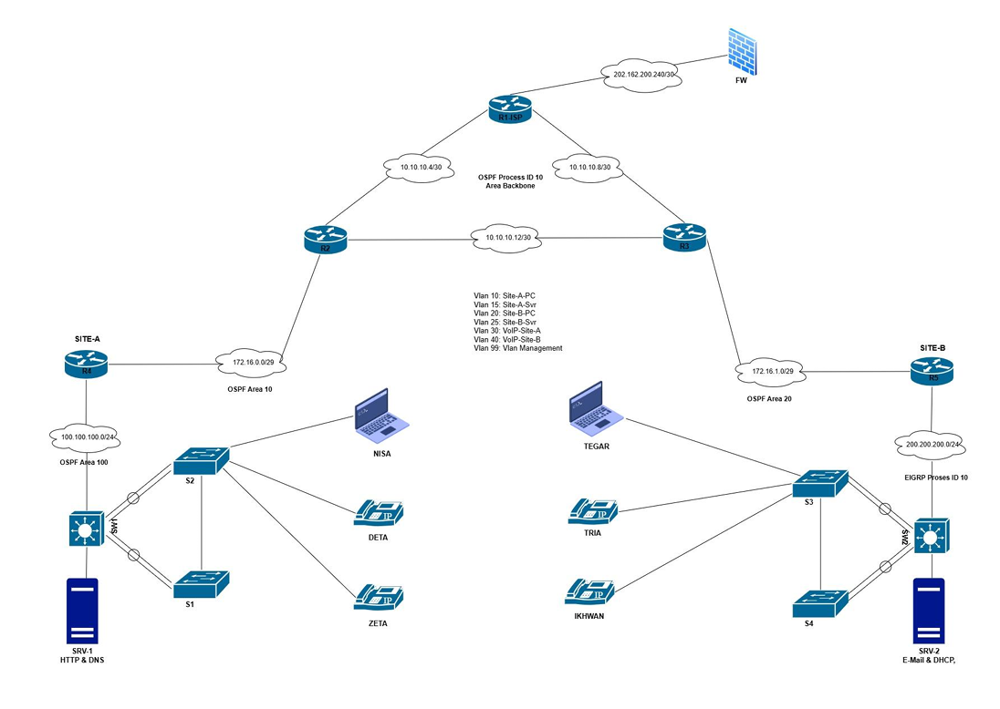
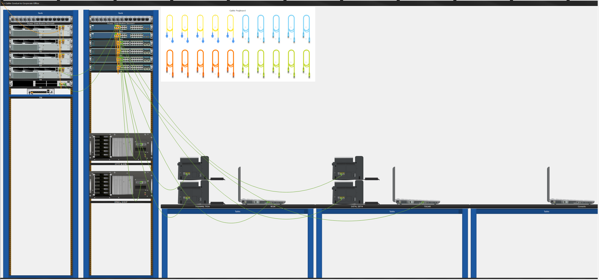
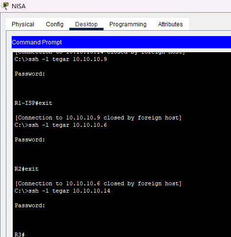

## E-Time Network Competition 2024 semifinal (77%) - Troubleshooting Challenge
### topology
### Topology
#### Logical View


#### Physical View


### soal
#### Description 
Anda sebagai network engineer ditugaskan untuk membenahi permasalahan jaringan yang terdapat pada soal troubleshooting ini. Setiap permasalahan sudah dituangkan dalam bentuk laporan ticket. Berusahalah memperbaiki setiap ticket yang ada dan juga berikanlah laporan berupa solusi dari setiap ticket yang berhasil anda kerjakan (PoC) !

##### List Of Ticket
<details>
<summary>List Of Ticket</summary>

##### Ticket 1
Terdapat laporan bahwasanya router backbone untuk koneksi p2p R1 dan R3 tidak bisa saling ping. Segera perbaiki ya!

##### Ticket 2
Karena sedang marak issue security, bos minta jaringannya dipasangkan firewall disisi terluar jaringan internet E-Time. Saat ini Firewall ASA baru dipasangkan saja belum ada konfigurasi. Coba kamu bantu setting Kearah interface router dengan nama “outside” dengan security level 0.

##### Ticket 3
Urgent!!, jaringan pada Site-A tidak berhasil terkoneksi ke jaringan ospf backbone, sehingga koneksi menjadi terganggu. Segera cari permasalahannya dan perbaiki!

##### Ticket 4
Info!!, jaringan pada Site-B menggunakan routing protokol eigrp. Sedangkan pada Site-A menggunakan routing protokol ospf. Bantu agar kedua routing tersebut dapat saling terkoneksi.

##### Ticket 5
Pada R1 merupakan router yang berperan menjadi ISP untuk memberikan internet kepada semua client dibawahnya, kamu diminta untuk menambahkan konfigurasi default route kearah upstream!

##### Ticket 6
Terjadi gangguan pada layanan etherchannel pada jaringan Site-B yang mengakibatkan jaringan protokol etherchannel tidak dapat berjalan. Mohon dicek dan diperbaiki!

##### Ticket 7
Tim support pada instansi etime ingin dapat mengakses perangkat router pada R1, R2 dan R3 secara remote dari laptop Tegar, buatkanlah akses remote tersebut dengan user tegar dan pass 123.

##### Ticket 8
Terdapat komplen bahwasanya layanan web pada server http hanya dapat diakses menggunakan alamat ip server. Tolong buatkan domain agar mempermudah akses ke web. Domain yang dibuatkan untuk akses ke web yaitu etime.com dan www.e-time2024.com dengan type A record dan juga CNAME.

##### Ticket 9
Karyawan atas nama tegar minta dibuatkan akun email ke tim IT agar bisa mengirimkan berkas berkas kerjaannya ke karyawan atas nama nisa. Saat ini yang sudah memiliki akun email hanya karyawan nisa. Segera buatkan dan setup dilaptopnya dengan nama user tegar dengan password 123.

##### Ticket 10
Ada laporan pada IP Phone pada Site-B tidak dapat digunakan untuk menelpon antar pegawai Tria dan Ikhwan, cek kenapa bisa terjadi dan selesaikan agar bisa digunakan untuk menelpon antar pegawai pada Site-B!

##### Ticket 11
Bos ingin layanan VoIP pada Site-A dan Site-B bisa terhubung satu sama lain agar komunikasi antar pegawai menjadi lebih mudah untuk dapat kordinasi antar site. coba kamu bantu konfigurasikan masalah ini tersolusikan.

##### Ticket 12
Setelah kamu mencoba memperbaiki semua ticket yang ada, kamu diminta bos untuk audit jaringan tersebut dengan menuliskan/mendokumentasikan semua services yang kamu temui kedalam file poc!

</details>

#### ADDRESSING TABLE
<details>
<summary>ADDRESSING TABLE</summary>

| Device | Interface | IP Address/Prefix        | Default Gateway        |
|--------|-----------|--------------------------|------------------------|
| R1-ISP | GI0/0     | 10.10.10.5/30            | -                      |
|        | GI0/1     | 10.10.10.9/30            | -                      |
|        | GI0/2     | 202.162.200.241/30       | 202.162.200.242/30     |
| R2     | GI0/0     | 10.10.10.6/30            | -                      |
|        | GI0/1     | 10.10.10.13/30           | -                      |
|        | GI0/2     | 172.16.0.1/29            | -                      |
| R3     | GI0/0     | 10.10.10.10/30           | -                      |
|        | GI0/1     | 10.10.10.14/30           | -                      |
|        | GI0/2     | 172.16.1.1/29            | -                      |
| R4     | GI0/0     | 172.16.0.2/29            | -                      |
|        | GI0/1     | 100.100.100.1/24         | -                      |
| R5     | Fa0/0     | 172.16.1.2/29            | -                      |
|        | Fa0/1     | 200.200.200.1/24         | -                      |
| SW1    | Fa/1      | 100.100.100.2/29         | -                      |
|        | VLAN 10   | 192.168.1.0/24           | 192.168.1.1            |
|        | VLAN 15   | 192.168.10.0/28          | 192.168.10.1           |
|        | VLAN 30   | 192.168.3.0/24           | 192.168.3.1            |
| SW2    | Fa/1      | 200.200.200.2/29         | -                      |
|        | VLAN 10   | 192.168.2.0/24           | 192.168.2.1            |
|        | VLAN 15   | 192.168.20.0/28          | 192.168.20.1           |
|        | VLAN 30   | 192.168.4.0/24           | 192.168.4.1            |
| SRV-1  | Fa0       | 192.168.10.10/28         | 192.168.10.1           |
| SRV-2  | Fa0       | 192.168.20.10/28         | 192.168.20.1           |
| NISA   | Fa0       | 192.168.1.10/24          | 192.168.1.1            |
| TEGAR  | Fa0       | 192.168.2.10/24          | 192.168.2.1            |
| VoIP-A | Fa0       | 192.168.3.0/24           | 192.168.3.1            |
| VoIP-B | Fa0       | 192.168.4.0/24           | 192.168.4.1            |
| FW     | G1/1      | 202.162.200.242/30       | -                      |

</details>

### Jawaban
#### Ticket 1
##### Router R3
```bash
int gig 0/0
 ip add 10.10.10.10 255.255.255.252
```

#### Ticket 2
##### ASA
```bash
interface GigabitEthernet1/1
 nameif outside
 security-level 0
 ! security level 0 (level terendah)
 ip address 202.162.200.242 255.255.255.252
 no shutdown
```

#### Ticket 3
##### Di R2 (Router-ID: 172.16.0.1)
```bash
router ospf 10
 area 10 virtual-link 172.16.0.2
```

#### Di R4 (Router-ID: 172.16.0.2)
```bash
router ospf 10
 area 10 virtual-link 172.16.0.1
```

#### Ticket 4
##### Router R5
```bash
router eigrp 10
 ! redistribute ospf 10 
 redistribute ospf 10 metric 1 1 1 1 1
router ospf 10
 redistribute eigrp 10 subnets 
```

#### Ticket 5 (gak nambah)
##### Router 1
```bash
do ping 202.162.200.242
ip route 0.0.0.0 0.0.0.0 202.162.200.242
router ospf 10
 default-information originate
```

#### Ticket 6
##### SW2
```bash
int ra fa 0/1-2
channel-group 1 mode active
do sh eth sum

int ra fa 0/2-3
 channel-group 1 mode active
int ra fa 0/2-5
 channel-protocol lacp
```

##### S3-S4
```bash
int ra fa 0/1-2 
 channel-group 1 mode active
 channel-protocol lacp
```

- ubah ip laptop tegar ke **192.168.2.10** karena ipnya slah

##### SITE A - SW1, S1, S2
###### SW1
```bash
int po 1
 sw trunk encap dot1q 
 sw mode tr
int po 2
 sw trunk encap dot1q 
 sw mode tr
```

###### S1-S2
```bash
int po 1
 sw mode tr
```

#### Ticket 7 (gak nambah persentasenya)
```bash
ip domain-name e-time2024.com
! if want version 2 use 1024, if version 1 use 512
! ip ssh version 2 only if u alrdey create key rsa with > 768 bit
crypto key generate rsa

ip ssh version 2
username tegar privilege 15 secret 123

line vty 0 15
 transport input ssh
 login local
```



#### Ticket 8
##### Server DNS & HTTP
- tambahkan record A        : name=e-time2024.com - host=192.168.10.10
- tambahkan record A        : name=mail.e-time2024.com - host=192.168.20.10
- tambahkan record CNAME    : name=www - hostname=e-time2024.com

- opsional dns
  - A - mail.etime.com - 192.168.20.10
  - CNAME - mail - etime.com

#### Ticket 9
##### Server EMAIL & DHCP
- add user email user:tegar, pass:123

- in pc client configure email
  - NISA - nisa@mail.etime.com - @mail.etime.com - nisa:123
  - TEGAR - tegar@mail.etime.com - @mail.etime.com - tegar:123

#### Ticket 10
##### R5
```bash
! int fa0/1
 ! ip helper-address 192.168.20.10

telephony-service
  ip source-address 200.200.200.1 port 2000

ephone-dn 1
 number 2001
ephone-dn 2
 number 2002
ephone-dn 3
 number 1003
```

#### Ticket 11
##### R4
```bash
dial-peer voice 1 voip 
 destination-pattern 200*
 session target ipv4:200.200.200.1
```

##### R5
```bash
dial-peer voice 1 voip 
 destination-pattern 100*
 session target ipv4:100.100.100.1
```

---

### Debugging
```bash
! untuk melihat route id
! untuk melihat neigboard

do show ip ospf 
do show ip ospf nei 

do sh ip proto
```