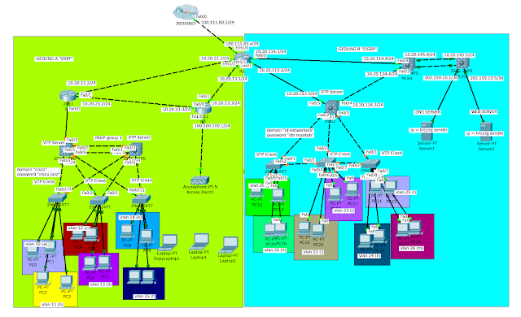
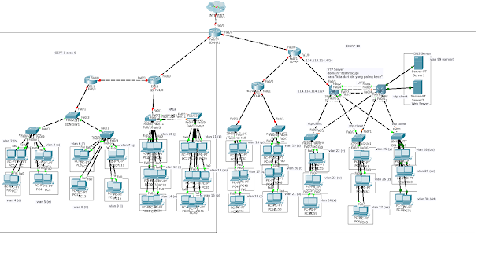
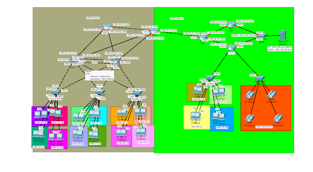
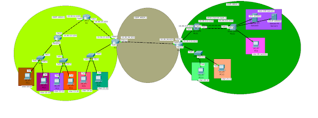
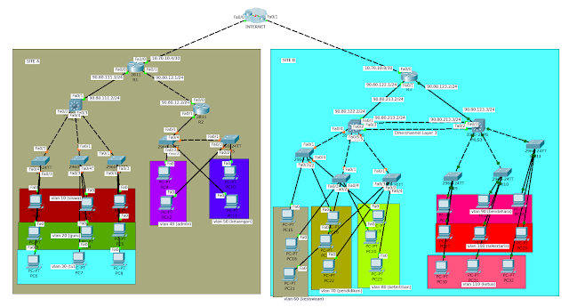

# Superlab
## Superlab 1
- [Blog](https://coretanbocahit.blogspot.com/2017/03/soal-superlab-1.html)
- [Link soal](https://drive.google.com/file/d/0B_e88Um0i6YPUTkyQkVjdGpIemM/view?resourcekey=0-XRTlDXWn5F-_j0Lx7M5_NA)

### topology

### Deskripsi materi
- VLAN
- Inter-VLAN Routing
- SVI (Switched Virtual Interface)
- DHCP Server
- NAT (Network Address Translation)
- PortFast Default
- EtherChannel
- Access List (ACL)
- VTP (VLAN Trunking Protocol)
- OSPF (Open Shortest Path First)
- EIGRP (Enhanced Interior Gateway Routing Protocol)
- Redistribution
- Wireless Networking

---

## Superlab 2
- [blog](https://coretanbocahit.blogspot.com/2017/03/soal-superlab-2.html)
- [link soal](https://drive.google.com/file/d/0B_e88Um0i6YPVU1JdlhaeTBCME0/view?resourcekey=0-A2z4nVMUfriMvFch10q1zw)

### topology

### Deskripsi materi
- VLAN
- Trunking
- VTP
- Etherchannel
- DHCP Server
- DNS & Web Server
- OSPF
- EIGRP
- Redistribution
- NAT

---

## superlab 3
- [Blog](https://coretanbocahit.blogspot.com/2017/03/soal-superlab-3.html)
- [Link soal](https://drive.google.com/file/d/0B_e88Um0i6YPc093Yl9kTEFPcEU/view?resourcekey=0--L0-Y72QiMHNQSo3uCeFCg)

### topology

### Deskripsi materi
- vlan
- trunking
- dhcp server
- hsrp
- vtp
- rstp
- multi area ospf
- voip
- DNS Server
- Web Server

---

## superlab 4
- [Blog](https://coretanbocahit.blogspot.com/2017/03/soal-superlab-4.html)
- [Link soal](https://drive.google.com/file/d/0B_e88Um0i6YPNjBvOXR2M3Zyb2s/view?resourcekey=0-71QcSgevrY65Q-_kRPUh6Q)

### topology

### Deskripsi materi
- vlan
- trunking (include allowed trunking)
- port fast
- dhcp relay
- ssh
- acl
- ntp server
- ntp client
- dhcp server

---

## superlab 5
- [Blog](https://coretanbocahit.blogspot.com/2017/03/soal-superlab-5.html)
- [Link soal](https://drive.google.com/file/d/0B_e88Um0i6YPRThpeVBYVUl1Qms/view?resourcekey=0-dPhW2HOjjI1YgOnF3wG-MA)

### topology

### Deskripsi materi
- vlan
- trunking
- EIGRP
- Static Routing
- Redistribute
- NAT
- Tunnel
- Standard Access List
- Extended Access List