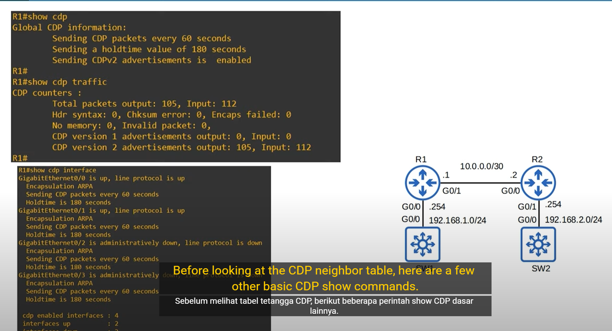

# 📘 Dokumentasi LLDP dan CDP di Cisco

---

## 🔹 LLDP (Link Layer Discovery Protocol)


### ✅ Pengertian

LLDP adalah **protokol standar IEEE 802.1AB** yang digunakan untuk pertukaran informasi antar perangkat jaringan (seperti switch, router, access point) di Layer 2. Protokol ini vendor-neutral, sehingga dapat bekerja lintas platform (Cisco, Juniper, HP, MikroTik, dll).

### 🧾 Informasi yang Dikirimkan

* Hostname
* Port ID
* System Description
* System Capabilities
* Management IP address (jika dikonfigurasi)

> ⚠️ **Catatan**: Tidak semua perangkat memberikan informasi IP, tergantung vendor dan konfigurasinya.

### ⏱️ Waktu Default LLDP

* **Timer (interval kirim):** 30 detik
* **Holdtime (masa berlaku informasi):** 120 detik

---

### ⚙️ Konfigurasi LLDP di Cisco

> Cisco **tidak mengaktifkan LLDP secara default**, sehingga perlu diaktifkan secara manual.

#### 1. Aktifkan LLDP Secara Global

```bash
conf t
lldp run
end
```

#### 2. Aktifkan LLDP di Interface Tertentu

```bash
conf t
interface GigabitEthernet0/1
 lldp transmit
 lldp receive
end
```

#### 3. Aktifkan LLDP di Semua Interface

```bash
conf t
interface range GigabitEthernet0/0 - 23
 lldp transmit
 lldp receive
end
```

#### 4. Menampilkan Informasi LLDP

```bash
show lldp
show lldp neighbors
show lldp neighbors detail
```

#### 5. Mengubah Timer LLDP (Opsional)

```bash
conf t
lldp timer 20
lldp holdtime 90
lldp reinit 2
end
```

#### 6. Fungsi `lldp reinit`

Digunakan untuk mengatur **waktu delay (dalam detik)** sebelum LLDP dimulai ulang setelah `lldp run`. Contohnya `lldp reinit 2` berarti LLDP akan mulai aktif 2 detik setelah aktif secara global.

---

## 🔹 CDP (Cisco Discovery Protocol)

### ✅ Pengertian

CDP adalah protokol proprietary milik Cisco yang berfungsi serupa dengan LLDP, yakni untuk pertukaran informasi perangkat antar perangkat Cisco di Layer 2.

### 📌 Fitur Khusus CDP

* Hanya untuk perangkat **Cisco**
* Diaktifkan secara **default**
* Menggunakan **Multicast MAC 0100.0CCC.CCCC**
* Informasi hanya dikonsumsi oleh perangkat Cisco langsung, tidak di-forward

### ⏱️ Waktu Default CDP

* **Timer (interval kirim):** 60 detik
* **Holdtime (masa berlaku informasi):** 180 detik

---

### ⚙️ Konfigurasi CDP di Cisco

#### 1. Mengaktifkan atau Menonaktifkan CDP Global

```bash
conf t
cdp run          # Mengaktifkan CDP
no cdp run       # Menonaktifkan CDP
end
```

#### 2. Mengaktifkan/Menonaktifkan CDP per Interface

```bash
interface GigabitEthernet0/1
 cdp enable       # Aktifkan CDP
 no cdp enable    # Nonaktifkan CDP
```

#### 3. Mengaktifkan CDP di Semua Interface

```bash
conf t
interface range GigabitEthernet0/0 - 23
 cdp enable
end
```

#### 4. Mengubah Timer dan Holdtime

```bash
conf t
cdp timer 45          # Default 60 detik
cdp holdtime 120      # Default 180 detik
end
```

#### 5. Menampilkan Informasi CDP

```bash
show cdp                         # Menampilkan status CDP
show cdp neighbors               # Informasi perangkat tetangga
show cdp neighbors detail        # Detail tetangga: IP, OS, Platform
show cdp interface               # CDP di interface mana saja aktif
show cdp traffic                 # Statistik pengiriman CDP
```

---

## 🔀 Perbandingan Singkat: LLDP vs CDP

| Fitur            | LLDP                     | CDP                      |
| ---------------- | ------------------------ | ------------------------ |
| Jenis            | Standar (IEEE 802.1AB)   | Proprietary (Cisco Only) |
| Default di Cisco | Tidak aktif              | Aktif                    |
| Interval Default | 30 detik                 | 60 detik                 |
| Holdtime Default | 120 detik                | 180 detik                |
| Informasi IP     | Bisa (tergantung vendor) | Ya (jika tersedia)       |
| Kompatibilitas   | Multivendor              | Hanya Cisco              |
| MAC Tujuan       | 01:80\:c2:00:00:0e       | 01:00:0c\:cc\:cc\:cc     |

---

## 🧪 Tips dan Use Case

* Gunakan **CDP** jika hanya memakai perangkat **Cisco**.
* Gunakan **LLDP** untuk integrasi dengan perangkat **non-Cisco**.
* **CDP/LLDP sangat berguna** untuk troubleshooting topologi layer 2 dan mengetahui perangkat tetangga dengan cepat.
* Untuk **network automation** atau pemetaan otomatis, LLDP sangat berguna karena bersifat standar.
