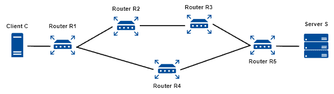
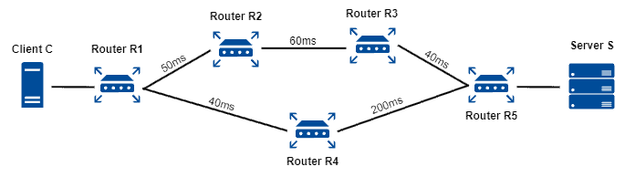

**Perbandingan Routing: Distance Vector vs. Link State (Versi Ringkas & Sederhana)**

Routing adalah proses memilih jalur agar data bisa sampai ke tujuannya dalam jaringan komputer. Ada dua pendekatan utama dalam **routing dinamis**:

---

### 1. Distance Vector

* **Cara kerja:** Router hanya tahu info dari tetangganya, lalu menghitung jarak ke tujuan berdasarkan "hop" (jumlah lompatan).
* **Metode:** Router berbagi tabel routing secara berkala.
* **Kelebihan:** Sederhana dan hemat bandwidth.
* **Kekurangan:** Lambat saat ada perubahan jaringan (konvergensi lambat), rentan terhadap loop.
* **Contoh protokol:** RIP (Routing Information Protocol).

---

### 2. Link State

* **Cara kerja:** Router mengetahui seluruh topologi jaringan dan menghitung jalur terbaik berdasarkan metrik (misalnya delay, bandwidth).
* **Metode:** Router menyebar info status link ke seluruh jaringan, lalu menjalankan algoritma (seperti Dijkstra).
* **Kelebihan:** Cepat beradaptasi dan akurat.
* **Kekurangan:** Konsumsi bandwidth lebih tinggi, lebih kompleks.
* **Contoh protokol:** OSPF dan IS-IS.

---

### Tabel Perbandingan

| Aspek                | Distance Vector | Link State                    |
| -------------------- | --------------- | ----------------------------- |
| Pandangan Jaringan   | Hanya tetangga  | Seluruh jaringan              |
| Tabel yang digunakan | Routing table   | Routing + Topologi + Tetangga |
| Frekuensi update     | Berkala         | Saat ada perubahan            |
| Waktu konvergensi    | Lambat          | Cepat                         |
| Konsumsi bandwidth   | Lebih rendah    | Lebih tinggi                  |
| Contoh protokol      | RIP             | OSPF, IS-IS                   |

---

### Kesimpulan

Tidak ada yang "lebih baik" secara mutlak antara Distance Vector dan Link State. Pemilihan protokol tergantung pada kebutuhan jaringan: ukuran, stabilitas, dan kapasitas perangkat yang digunakan.
