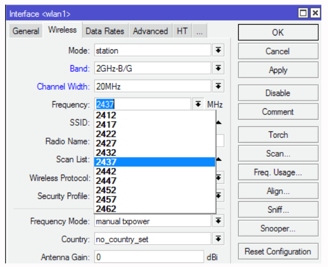
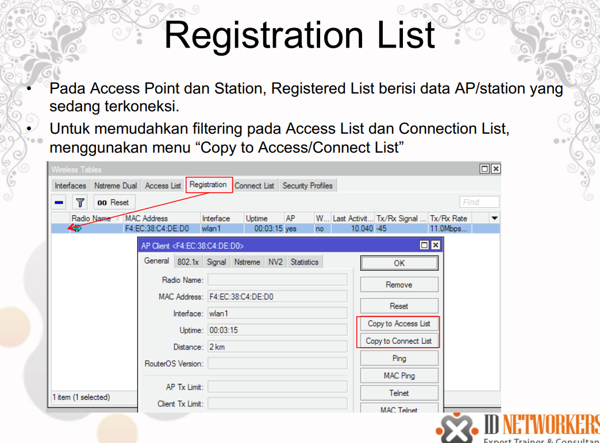

<a href="../../README.md#back">Back README.md...</a>

# Wireless
- RouterOS mendukung beberapa modul radio (wireless card) untuk jaringan WLAN atau Wi-Fi (Wireless Fidelity)
- Wi-Fi memiliki standar & spesifikasi IEEE 802.11 dan menggunakan frekuensi 2,4GHz dan 5,8GHz
- MikroTik mendukung standar IEEE 802.11a/b/g/n
    -  802.11a – frekuensi 5GHz, 54Mbps.
    – 802.11b – frekuensi 2,4GHz, 11 Mbps.
    – 802.11g – frekuensi 2,4GHz, 54Mbps.
    – 802.11n (Level 4 keatas) – frekuensi 2,4GHz atau 5GHz, 300Mbps

## Wireless Band
- Band merupakan mode kerja frekuensi dari suatu perangkat wireless
- Untuk menghubungkan 2 perangkat, keduanya harus bekerja pada band frekuensi yang sama

## Wireless – Frequency Channel
- Frequency channel adalah pembagian frekuensi dalam suatu band dimana Access Point (AP) beroperasi
- Nilai-nilai channel bergantung pada band yang dipilih, kemampuan wireless card, dan aturan/regulasi frekuensi suatu negara
- Range frequency channel untuk masing-masing band adalah sbb:
    – 2,4Ghz = 2412 s/d 2499MHz
    – 5GHz = 4920 s/d 6100MHz

## Wireless – Lebar Channel
- Lebar channel adalah rentang frekuensi batas bawah dan batas atas dalam 1 channel
- MikroTIk dapat mengatur berapa lebar channel yang akan digunakan
- Default lebar channel yang digunakan adalah 22Mhz (ditulis 20MHz)
- Lebar channel dapat dikecilkan (5MHz) untuk meminimasil frekuensi, atau dibesarkan (40MHz) untuk mendapatkan troughtput yang lebih besar

## Wireless – Regulasi Frekuensi
- Setiap negara memiliki regulasi tertentu dalam hal frekuensi wireless untuk internet carrier
- Indonesia telah merdeka untuk menggunakan frekuensi 2.4GHz berdasarkan KEPMENHUB No. 2/2005 berkat perjuangan para penggerak internet sejak tahun 2001
- Regulasi tersebut dalam mikrotik didefinisikan pada bagian Wireless “country-regulation
- Namun apabila diinginkan untuk membuka semua frekuensi yang dapat digunakan oleh wireless card, dapat menggunakan pilihan “superchannel”.

## Frequency Mode
1. manual-tx-power
    - Transmit power diatur manual (tidak menyesuaikan dengan negara tertentu).
2. regulation-domain
    - Frekuensi channel disesuaikan dengan frekuensi-frekuensi yang diijinkan di suatu negara.
3. Superchannel
    - Membuka semua frekuensi yang bisa disupport oleh wireless card

## Konsep Koneksi Wireless
- Kesesuaian Mode: (AP-Station, AP-Repeater, Repeater-Repeater )
- Kesesuaian BAND
- Kesesuaian SSID
- Kesesuaian enkripsi dan authentifikasi
- Frekuansi channel tidak perlu sama, station secara otomatis akan mengikuti channel frekuensi pada AP

## mode wireless
- AP Mode
    - AP-bridge – wireless difungsikan sebagai Akses Poin.
    - Bridge - hampir sama dengan AP-bridge, namun hanya bisa dikoneksi
         - oleh 1 station/client, mode ini biasanya digunakan untuk point-to-point
- Station Mode
    - Station – scan dan conent AP dengan frekuensi & SSID yang sama, mode ini TIDAK DAPAT di BRIDGE
    - Station-bridge – sama seperti station, mode ini adalah MikroTik proprietary. Mode untuk L2 bridging, selain wds
    - Station-wds – sama seperti station, namum membentuk koneksi WDS dengan AP yang menjalankan WDS
    - station-pseudobridge-clone – Sama seperti station-pseudobridge, menggunakan station-bridge-clone-mac address untuk konek ke AP
- Special Mode
    - alignment-only – mode transmit secara terus-menerus digunakan untuk positioning antena jarak jauh.
    - nstreme-dual-slave – digunakan untuk sistem nstreme-dual.
    - WDS-slave - Sama seperti ap-bridge, namun melakukan scan ke AP dengan SSID yang sama dan melakukan koneksi dengan WDS.
        - Apabila link terputus, akan melanjutkan scanning
 
## LAB – Wireless AP & Station
- Satu peserta manjadi Acess Point, satunya menjadi Station (wireless mode)
- Samakan SSID, band dan security profile.
- Setting IP Address interface wlan:
    - IP AP= 10.10.10.1/24
    - IP station = 10.10.10.2/24
- Pastikan koneksi wireless (layer 1) terhubung, baru dapat dilakukan ping antar IP (layer 3)
- Lakukan ping dari masing-masing MikroTik.
- Lakukan bandwidth test antar Mikrotik

# Wireless Tools
- Scan => untuk melihat informasi AP yang aktif, beserta SSID dan memudahkan untuk membuat koneksi ke AP aktif tersebut.
- Align => untuk pointing antenna.
- Sniff => untuk melihat lalu lintas paket data di jaringan.
- Snooper => seperti tool scan, informasi AP yang aktif secara lengkap, SSID, channel yang digunakan, 
    - signal strength, utilisasi/traffic load dan jumlah station pada masing-masing AP.
- Bw Test => digunakan untuk test bandwidth khusus untuk MikroTik, bw test dapat didownload di web resmi MikroTik

## Wireless MAC Filtering
- Access Point, dapat dilakukan pembatasan hak akses dimana AP hanya dapat dikonek oleh station yang sudah kita tentukan
- Station, juga dapat dilock agar terkoneksi dengan AP yg sudah ditentukan.
- Mac filtering AP ada di Access List
- Mac filtering Station ada di Connect List.

## Access Point – Access List
- Access List pada Access Point, memfilter station mana saja yang boleh terkoneksi
- Access List dapat berfungsi apabila wireless default authenticate di non aktifkan (uncheck).
    - Artinya by default station tidak akan bisa konek ke AP apabila tidak di allow di Access List

## access list

## connect list

## Registration List
- Pada Access Point dan Station, Registered List berisi data AP/station yang sedang terkoneksi
- Untuk memudahkan filtering pada Access List dan Connection List, menggunakan menu “Copy to Access/Connect List”

## Default Authenticated
- Untuk menggunakan pilihan Connection List atau Access List baik pada AP atau Station Default Authenticated harus di uncheck

# LAB-Wireless Mac Filtering
- Filter mac address agar koneksi point to point anda dengan partner tidak mudah dikacaukan oleh koneksi lain.
- Masukkan data mac address wireless partner ke list yang benar.
- Jika sebagai Station masukkan kedalam Connect-List, apabila sebagai AP masukkan dalam Access-List.
- Untuk setting wireless pada AP, default authenticate harus di-uncheck, agar tidak semua client bisa teraouthentikasi secara otomatis.
- Coba untuk konek ke AP yang bukan pasangan

# Nstreme
- Nstreme adalah protocol wireless proprietary Mikrotik
- Meningkatkan perfomance link wireless jarak jauh
- Untuk konek fitur Nstreme harus diaktifkan baik di sisi AP maupun station
- Konfigurasi Nstreme hanya di sisi AP, client hanya meng-enable-kan saja

# Wireless Security
- Untuk pengamanan koneksi wireless, tidak hanya cukup dengan MAC-Filtering, karena data yang lewat ke jaringan bisa diambil dan dianalisa.
- Terdapat metode keamanan lain yang dapat digunakan yaitu
    - Authentication (WPA-PSK, WPA-AEP)
    – Enkripsi (AES, TKIP, WEP)

# LAB - Virtual Access Point
- Virtual AP akan menjadi child dari wlan (interface real)
- Satu interface dapat memiliki banyak virtual AP (maksimum 128)
- Virtual AP dapat diset dengan SSID, security profile dan access list yang berbeda, namun menggunakan frekuensi dan band yang sama dengan wlan induk
- Virtual AP bersifat sama seperti AP:
    - Dapat dikoneksikan dengan station / client.
    - Dapat difungsikan sebagai DHCP server.
    - Dapat difungsikan sebagai Hotspot server
