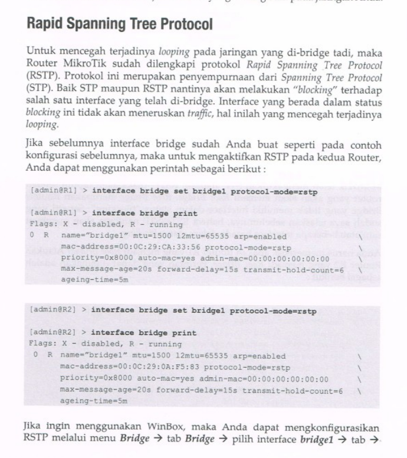

# load balancing


- cara kerjanya adalah membagi packet agar pada tiap interface
```sh
ip route add dst-address=192.168.10.0/24 gateway=10.10.10.1,10.1.1.1
```

# fail over
- ini digunakan ketika kita hanya ingin membuat link cadangan ketika salah satu link mati
```sh
ip route add dst-address=192.168.10.0/24 gateway=10.10.10.1 check-gateway=ping
ip route add dst-address=192.168.10.0/24 gateway=10.1.1.1 check-gateway=ping distance=2
```

# ip dhcp server relay


```sh
# server gateway
ip pool add name=LAN-1 ranges=192.168.1.2-192.168.1.10
ip dhcp-server network add address=192.168.1.0/24 netmask=255.255.255.0 dns-server=8.8.8.8 gateway=192.168.1.1 ntp-server=10.10.10.6

ip dhcp-server add name="LAN-1" relay=192.168.1.1 address-pool=LAN-1 interface=ether2 disabled=no

# relay router
ip dhcp-relay add name=LAN-2 interface=ether3 dhcp-server=10.10.10.1 local-address=192.168.10.1 disabled=no
```


# bridge rstp



```
interface bridge add name=LAN protocol-mode=rstp

interface bridge monitor 0
interface bridge port monitor 0
interface bridge port monitor 1
```

# bridge with eoip
- bridge with eoip


# firewall
## jump
- action jump akan melakukan jump ke rule selanjutnya


## return
- mengembalikan packet ke rule sebelumnya (default untuk di cek lagi) jika ketika paket di jump tidak menemukan rule yang cocok


## chain


## mac login
```sh
tool mac-scan ether1
tool mac-telnet 02:CC:E8:C2:D3:CB

tool mac-server print

tool mac-server mac-winbox
tool mac-server sessions print
```

# nat
- merupah ip private menjadi ip public
