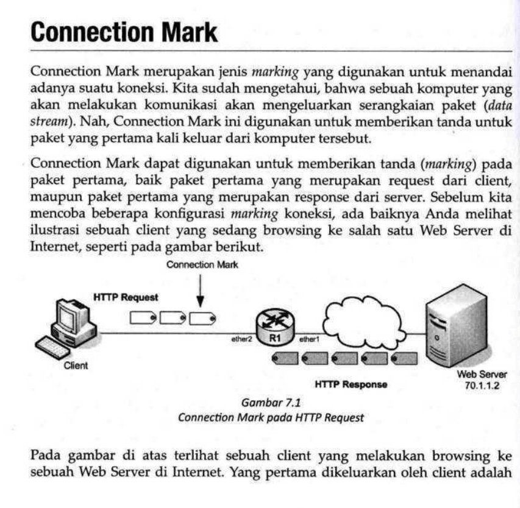
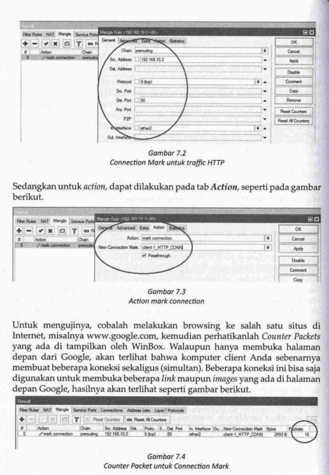
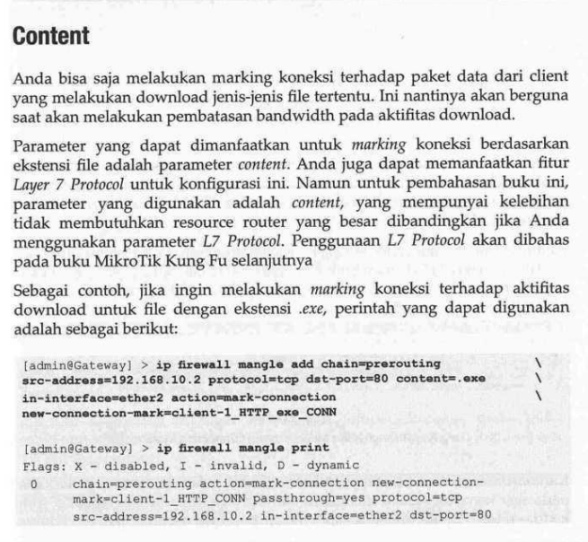
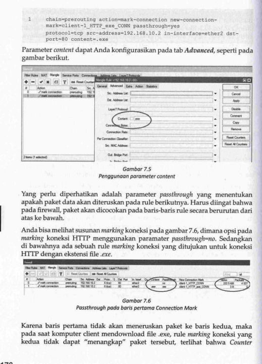
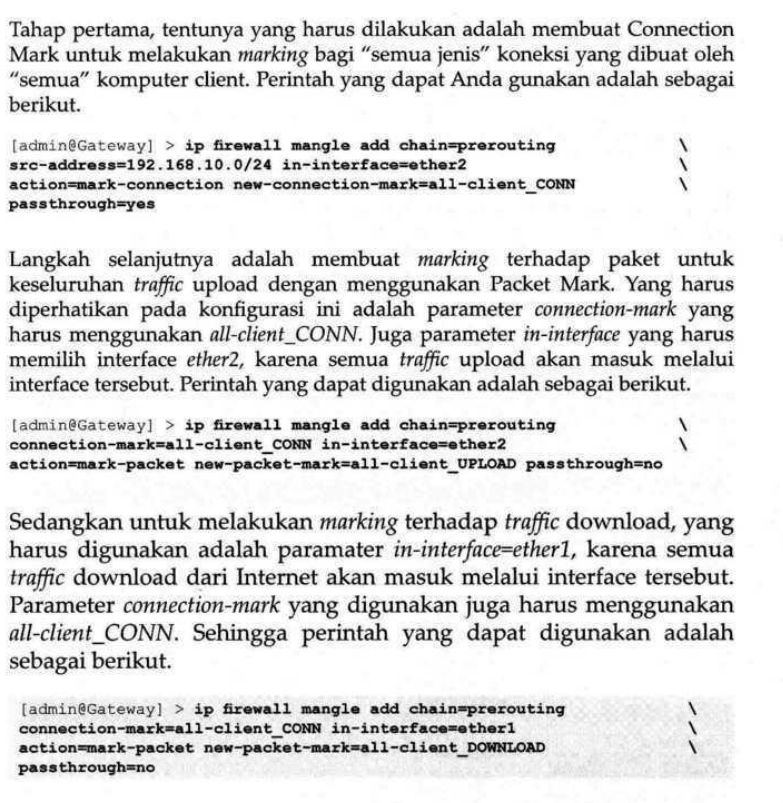
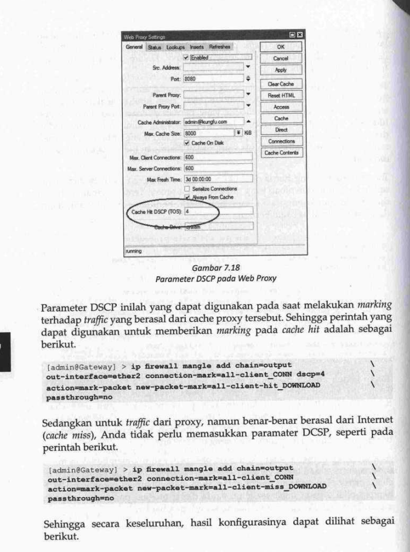
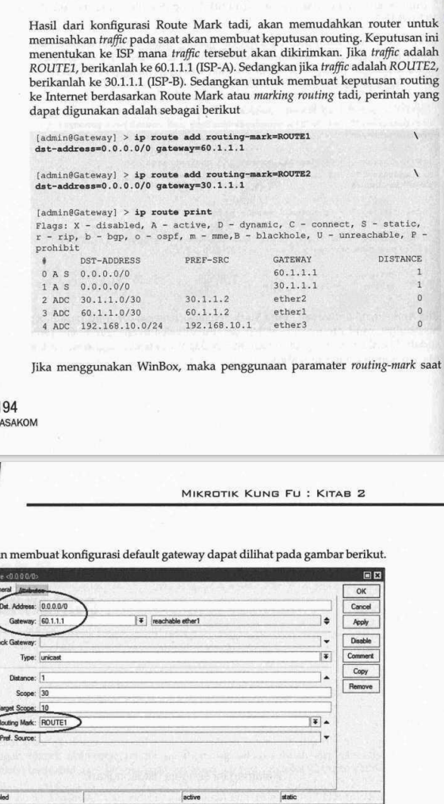

# nat
```
ip firewall nat add chain=dst-nat src-address=10.11.100.101 action=dst-nat to-addresses=172.16.10.2
# ingat to-address harus address jangan subnet
```

## netmap => mirip dengna dst nat akan mengalihkan ip router ke ip yang dituju
```
ip firewall nat add chain=dst-nat src-address=10.11.100.101 action=netmap to-addresses=172.16.10.2
```

# mangle
- memberi tanda (mark) pada packet
- jenis
    - connection mark
    - packet mark
    - route mark

## connection mark
- jenis marking untuk menandai sebuah koneksi

- konfigurasi
```sh
ip firewall mangle add chain=prerouting src-address=192.168.10.2 protocol=tcp dst-port=80 in-interface=ether2 action=mark-connection new-connection-mark=client1-HTTP_CONN  
ip firewall mangle add chain=prerouting src-address=192.168.10.2 protocol=tcp in-interface=ether2 action=mark-connection new-connection-mark=client1-CONN
```


### content
- jenis marking untuk koneksi terhadap pakeet tertentu yang melakukan download atau fie tertentu

- konfigurasi
```sh
ip firewall mangle add chain=prerouting src-address=192.168.10.2 protocol=tcp dst-port=80 /
content=.exe in-interface=ether2 action=mark-connection new-connection-mark=client1-HTTP_exe_CONN passthrough=yes
```

- passthrough=yes diperlukan agar ketika paket yang di mark sebelumnya akan di mark kembali dengan rule selanjutnya

## packet mark
- jenis marking packet ketika paket sudah terhubung / koneksi
- konfigurasi

```bash
ip firewall mangle add chain=prerouting src-address=192.168.10.2 protocol=tcp in-interface=ether2 action=mark-connection new-connection-mark=all-client1-CONN passthrought=yes # passthrought yes agar ketika packet sudah di mark dapat di mark lagi

ip firewall mangle add chain=prerouting in-interface=ether2 passthrough=no/ # no karena agar packet tidak di mark lagi
connection-mark=all-client1-CONN action=mark-connection new-packet-mark=all-client_upload-CONN

ip firewall mangle add chain=prerouting in-interface=ether1 passthrough=no/ # ether 1 karena kalau download paket yang masuk berasal dari ether 1
connection-mark=all-client1-CONN action=mark-connection new-packet-mark=all-client_download-CONN
```

### proxy packet mark

- enable ip > web proxy dscp=4
```sh
ip firewall mangle add chain=prerouting in-interface=ether1 passthrough=no
connection-mark=all-client1-CONN action=mark-connection new-packet-mark=all-client_hit_download-CONN dscp=4

ip firewall mangle add chain=prerouting in-interface=ether1 passthrough=no
connection-mark=all-client1-CONN action=mark-connection new-packet-mark=all-client_miss_download-CONN dscp=4
```

## route mark
- jenis mark packet data untuk keperluan routing


### router mark

