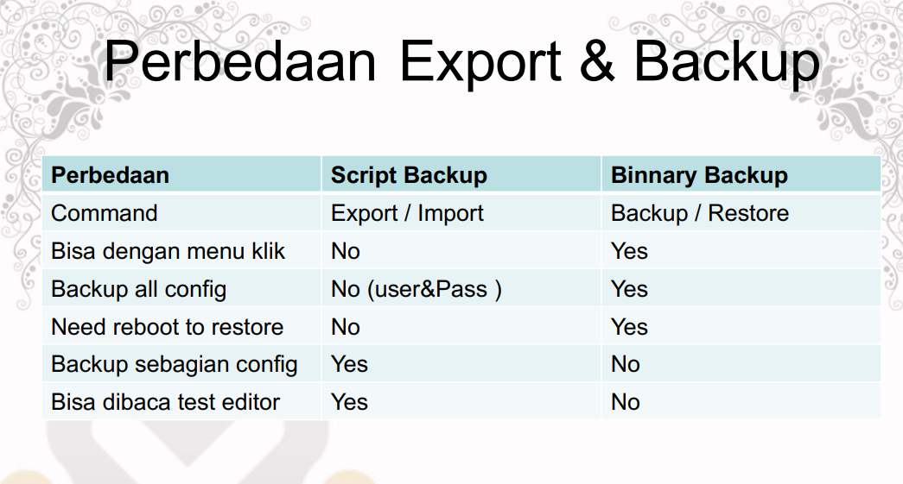
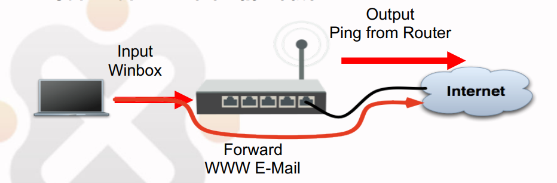
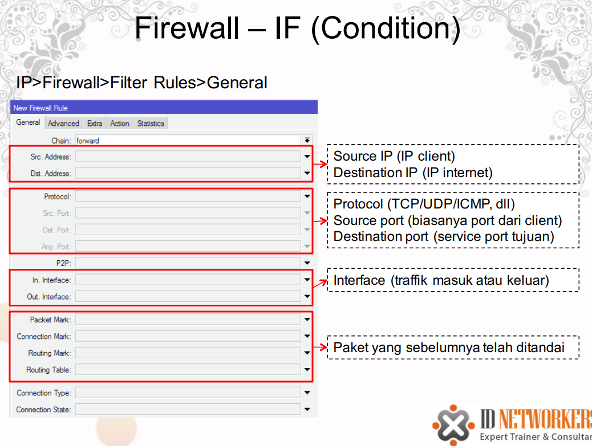
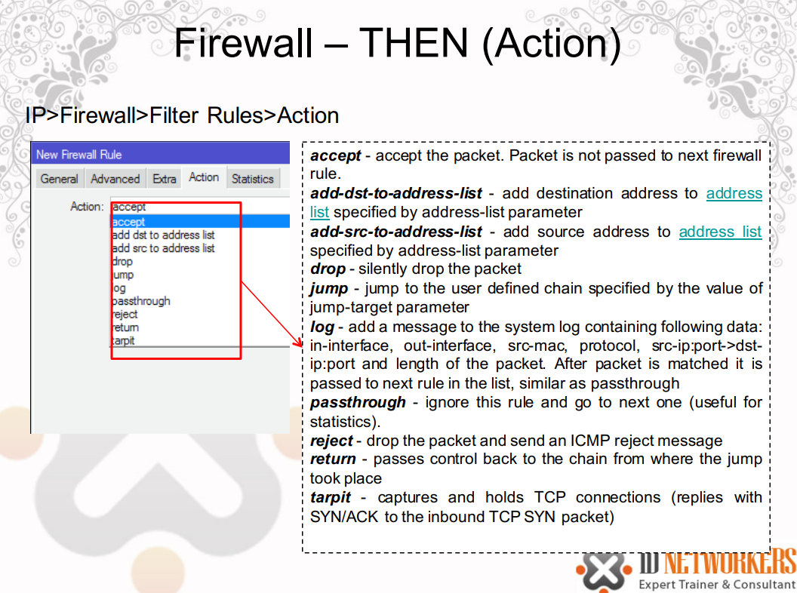

<a href="../../README.md#back">Back README.md...</a>

# mereset mirkotik router board
- tahan tombol reset dan colokan kabel poe nyaa hingga berkedip
- jika kita masih bisa terhubung dengan mikrotik kita bisa langsung reset dengan
```sh
system reset-configuration no-defaults=yes skip-backup=yes
```

# masuk ke winbox
- pastikaan mikrotik sudah di reset dengan tombol tadi
- ubah ip kita menjadi 192.168.88.1
- lalu coneksikan
- lalu reset mikrotik dengan option no default configuration, dan no baackup config
- dengan ini kita bisa mengonfig  mikrotik dengankonfigurasi yang masih kosong

# license
- Lisensi menentukan versi berapa dari MikroTikOS yang dapat diinstall/diupgrade di suatu hardware
- Upgrade bersifat unlimited, artinya diperbolehkan upgrade sampai versi berapapun

## daftar license
| Level number                 | 0 (Trial mode) | 1 (Free Demo)         | 3 (WISP CPE)        | 4 (WISP)  | 5 (WISP)  | 6 (Controller) |
|------------------------------|----------------|-----------------------|---------------------|-----------|-----------|----------------|
| Price                        | no key         | registration required | not sold separately | $45       | $95       | $250           |
| Wireless AP                  | 24h trial      | -                     | -                   | yes       | yes       | yes            |
| Wireless Client and Bridge   | 24h trial      | -                     | yes                 | yes       | yes       | yes            |
| RIP, OSPF, BGP protocols     | 24h trial      | -                     | yes                 | yes       | yes       | yes            |
| EoIP tunnels                 | 24h trial      | 1                     | unlimited           | unlimited | unlimited | unlimited      |
| PPPoE tunnels                | 24h trial      | 1                     | 200                 | 200       | 500       | unlimited      |
| PPTP tunnels                 | 24h trial      | 1                     | 200                 | 200       | 500       | unlimited      |
| L2TP tunnels                 | 24h trial      | 1                     | 200                 | 200       | 500       | unlimited      |
| OVPN tunnels                 | 24h trial      | 1                     | 200                 | 200       | unlimited | unlimited      |
| VLAN interfaces              | 24h trial      | 1                     | unlimited           | unlimited | unlimited | unlimited      |
| HotSpot active users         | 24h trial      | 1                     | 1                   | 200       | 500       | unlimited      |
| RADIUS client                | 24h trial      | -                     | yes                 | yes       | yes       | yes            |
| Queues                       | 24h trial      | 1                     | unlimited           | unlimited | unlimited | unlimited      |
| Web proxy                    | 24h trial      | -                     | yes                 | yes       | yes       | yes            |
| User manager active sessions | 24h trial      | 1                     | 10                  | 20        | 50        | Unlimited      |
| Number of KVM guests         | none           | 1                     | Unlimited           | Unlimited | Unlimited | Unlimited      |

## melihat license
```sh
system license print
```

# Versi MikroTik
- Fitur-fitur MikroTik selain ditentukan oleh lisensi yang digunakan, juga ditentukan oleh versi dari MikroTik yang terinstall.
- Pada RouterOS, versi MikroTik dapat dilihat dari paket yang terinstall.
- Paket-paket yang terinstall menunjukkan fitur apa saja yang dijalankan oleh RouterOS.

## paket mikroitik
| Paket | Fitur |
|:---:|:---:|
| Alat lanjutan (MIPSLE, MIPSBE, PPC, X86, MMIPS, ARM, SMIPS) | Alat ping canggih (banjir-ping, kecepatan ping), Netwatch, ip-scan, alat SMS, Wake-on-LAN |
| Calea (Mipsle, Mipsbe, PPC, X86, MMIPS, Lengan) | Alat pengumpulan data untuk penggunaan khusus karena "Bantuan Komunikasi untuk Undang-Undang Penegakan Hukum" di AS |
| DHCP (MIPSLE, MIPSBE, PPC, X86, MMIPS, ARM, SMIPS) | Klien dan server Protokol Kontrol Host Dinamis |
| GPS (MIPSLE, MIPSBE, PPC, X86, MMIPS, LENGAN) | Dukungan perangkat Sistem Pemosisian Global |
| Hotspot (MIPSLE, MIPSBE, PPC, X86, MMIPS, ARM, SMIPS) | Server portal captive HotSpot untuk manajemen pengguna |
| IPv6 (Mipsle, Mipsbe, PPC, X86, MMIPS, ARM, SMIPS) | Dukungan pengalamatan IPv6 |
| LTE (mipsbe) | Paket yang diperlukan hanya untuk SXT LTE (RBSXTLTE3-7), yang berisi driver untuk antarmuka LTE bawaan. |
| MPLS (MIPSLE, MIPSBE, PPC, X86, MMIPS, ARM, SMIPS) | Dukungan Pengalihan Label Multi Protokol |
| Multicast (MIPSLE, MIPSBE, PPC, X86, MMIPS, ARM, SMIPS) | Multicast Independen Protokol - Mode Jarang; Protokol Pengelola Grup Internet - Proxy |
| NTP (Mipsle, Mipsbe, PPC, X86, MMIPS, Lengan) | Server protokol jaringan, juga mencakup klien sederhana. Klien NTP juga dibangun ke dalam paket sistem dan berfungsi dengan baik tanpa menginstal paket ini. |
| Aliran terbuka (Mipsle, MIPSBE, PPC, X86, MMIPS, ARM, SMIPS) | Mengaktifkan dukungan OpenFlow |
| PPP (Mipsle, Mipsbe, PPC, X86, MMIPS, LENGAN, SMIPS) | Klien dan server MlPPP, PPP, PPTP, L2TP, PPPoE, ISDN PPP |
| Papan Router (MIPSLE, MIPSBE, PPC, X86, MMIPS, LENGAN) | mengakses dan mengelola RouterBOOT. Pemberitahuan khusus RouterBOARD. |
| Perutean (MIPSLE, MIPSBE, PPC, X86, MMIPS, ARM, SMIPS) | protokol perutean dinamis seperti RIP, BGP, OSPF dan utilitas perutean seperti BFD, memfilter rute. |
| Keamanan (MIPSLE, MIPSBE, PPC, X86, MMIPS, ARM, SMIPS) | IPSEC, SSH, Secure WinBox (diperlukan untuk versi Winbox hingga v3.14). Tergantung pada paket dhcp. |
| Sistem (MIPSLE, MIPSBE, PPC, X86, MMIPS, ARM, SMIPS) | fitur router dasar seperti perutean statis, alamat ip, sNTP, telnet, API, antrian, firewall, proxy web, cache DNS, TFTP, kumpulan IP, SNMP, sniffer paket, alat pengiriman email, grafik, uji bandwidth, obor, EoIP, IPIP, jembatan, VLAN, VRRP dll.). Juga, untuk platform RouterBOARD - MetaROUTER \| Virtualisasi |
| TR069 (MIPSBE, PPC, X86, MMIPS, Lengan) | Paket klien TR069 |
| UPS (MIPSLE, MIPSBE, PPC, X86, MMIPS, LENGAN) | Antarmuka manajemen ups APC |
| Manajer pengguna (MIPSLE, MIPSBE, PPC, X86, MMIPS, ARM) | Server MikroTik User Manager untuk mengontrol Hotspot dan pengguna layanan lainnya. |
| Nirkabel (MIPSLE, MIPSBE, PPC, X86, MMIPS, ARM, SMIPS) | dukungan antarmuka nirkabel. Terkadang sub-tipe dirilis, misalnya wireless-fp memperkenalkan dukungan FastPath, wireless-cm2 memperkenalkan CAPsMAN v2 dan wireless-rep memperkenalkan mode Repeater. Paket-paket ini kadang-kadang dirilis secara terpisah, sebelum fitur-fitur baru digabungkan ke dalam paket nirkabel utama. |
| Arlan (x86) | dukungan Aironet Arlan lama |
| isdn (x86) | Dukungan modem ISDN |
| LCD (x86) | Dukungan panel LCD untuk perangkat port serial/paralel. Tidak diperlukan untuk panel LCD RouterBOARD. |
| radiolan (x86) | Dukungan kartu RadioLan |
| sinkron (x86) | Dukungan FarSync |
| xen ( dihentikan x86) | Virtualisasi XEN |
| kvm (x86) | Virtualisasi KVM |
| routeros-mipsle (mipsle) | paket gabungan untuk mipsle (RB100, RB500) (termasuk sistem, hotspot, nirkabel, ppp, keamanan, mpls, alat canggih, DHCP, Routerboard, IPv6, Perutean) |
| routeros-smips (smips) | paket gabungan untuk smips (hAP mini, hAP lite) (termasuk sistem, hotspot, nirkabel, ppp, keamanan, mpls, alat canggih, dhcp, routerboard, ipv6, routing) |
| routeros-mipsbe (mipsbe) | Paket gabungan untuk mipsbe (RB400) (termasuk sistem, hotspot, nirkabel, PPP, keamanan, mpls, alat canggih, DHCP, Routerboard, IPv6, Perutean) |
| routeros-powerpc (ppc) | paket gabungan untuk powerpc (RB300, RB600, RB1000) (termasuk sistem, hotspot, nirkabel, ppp, keamanan, mpls, alat canggih, DHCP, Routerboard, IPv6, Perutean) |
| routeros-x86 (x86) | paket gabungan untuk x86 (Intel / AMD PC, RB230) (termasuk sistem, hotspot, nirkabel, ppp, keamanan, mpls, alat lanjutan, dhcp, routerboard, IPv6, perutean) |
| routeros-mmips (mmips) | Paket gabungan untuk mips multicore (Mxx, RB750v3) (termasuk sistem, hotspot, nirkabel, ppp, keamanan, mpls, alat canggih, dhcp, routerboard, IPv6, perutean) |
| routeros-arm (lengan) | paket gabungan untuk lengan (cAP ac, hAP ac², CRS3xx, RB3011, RB1100AHx4, dll) (termasuk sistem, hotspot, nirkabel, ppp, keamanan, mpls, alat lanjutan, dhcp, routerboard, ipv6, perutean) |

## perintah system package
| Command | Desciption |
|:---:|:---:|
| disable | schedule the package to be disabled after the next reboot. No features provided by the package will be accessible |
| downgrade | will prompt for the reboot. During the reboot process will try to downgrade the RouterOS to the oldest version possible by checking the packages that are uploaded to the router. |
| print | outputs information about the packages, like: version, package state, planned state changes etc. |
| enable | schedule package to be enabled after the next reboot |
| uninstall | schedule package to be removed from the router. That will take place during the reboot. |
| unschedule | remove scheduled task for the package. |

```sh
system package print

# uninstall package
/system package uninstall ppp; # untuk benar benar menguninstall packagenya perlu di reboot terlebih dahulu

# disable package
/system package disable hotspot; /system reboot; # dengan meschedule disable dan reboot dengan 1 perintah

# downgrade
/system package downgrade; /system reboot;

# Cancel uninstall or disable action
/system package unschedule ipv6 # cancel
```

# install ulang mikrotik
## windows

## linux
- change your ip 192.168.88.1
- open terminal
```sh
wget https://download.mikrotik.com/routeros/[VERSION]/netinstall-[VERSION].tar.gz
tar -xzf netinstall-[VERSION].tar.gz
./netinstall-cli -a 192.168.0.1 routeros-arm64-[VERSION].npk

# contoh
sudo ifconfig <interface> 192.168.88.2/24
sudo ./netinstall -r -a 192.168.88.3 routeros-mipsbe-6.48.1.npk
sudo ./netinstall-cli -e -b -i enx1234567ee890 -a 192.168.88.3 routeros-7.14.2-arm.npk wireless-7.14.2-arm.npk
```

# setting booting
- try-ethernet-once: Perangkat akan mencoba boot melalui jaringan Ethernet sekali. 
    - Ini berguna jika Anda ingin mencoba mem-boot perangkat dari server jaringan menggunakan metode seperti PXE (Preboot Execution Environment).
- then-nand: Jika boot melalui Ethernet gagal atau tidak tersedia, perangkat akan melanjutkan boot dari NAND flash memory internal. 
    - NAND adalah jenis memori non-volatile yang digunakan untuk menyimpan sistem operasi RouterOS dan konfigurasi pada perangkat RouterBOARD.

```
/system routerboard settings set boot-device=try-ethernet-once-then-nand
```

# IP Services
- Menghidukan/mematikan service yang dijalankan oleh Router.
- Setting konfigurasinya ada di menu IP>Services
- Untuk keamanan kita juga dapat mengganti/mengubah default port pada masing-masing services
```
ip service print
ip service enable telnet
ip service disable telnet
```

# User Login Management
- Akses ke router ditentukan oleh menu user
- Manajemen user dilakukan dengan
    – GROUP – profil pengelompokan user, menentukan previlage yang bisa diperoleh suatu user.
    – USER – merupakan login (username & password dari suatu user)
- Sesi user yang sedang melakukan koneksi ke router dapat dilihat pada menu System>Users>Active Userrs

## user login management group
- Group merupakan pengelompokan previlage/hak akses  yang akan diberikan pada user.
- Ada 3 default previlage yang ada di MikroTik yaitu 
    - full, 
    - read 
    - write,
    - custom

## User Login Management - Akses
- Masing-masing user dapat dibatasi hak aksesnya berdasarkan group.
- Masing-masing user juga dapat dibatasi berdasarkan IP address yang digunakannya.

# MikroTik Neighbor Discovery Protocol (MNDP)
- MNDP memudahkan konfigurasi dan manajemen jaringan dengan memungkinkan setiap router MikroTik untukmendeteksi MikroTik lainnya yang terhubung langsung
- MNDP fitur:
    – bekerja pada layer 2
    – bekerja pada semua non-dinamic interface
    – mendistribusikan informasi dasar
- MNDP dapat berkomunikasi dengan CDP (Cisco Discovery Protocol).
- Disarankan untuk tidak memancarkan MNDP ke interface yang mengarah ke jaringan public

## Block MNDP
- Untuk menyembunyikan mikrotik anda agar tidak muncul pada Winbox MNDP scan, atau muncul pada neigbors:
1. Disable MNDP pada menu IP Neighbors Discovery
2. Block Port UDP protocol port 5678 (port untuk komunikasi MNDP) menggunakan IP Firewall Filter Rule

# Backup dan Restore
- Konfigurasi dalam router dapat dibackup dan disimpan untuk digunakan di kemudian hari. 
- Ada 2 jenis backup yaitu
1. Binary file (.backup)
    - Tidak dapat dibaca text editor.
    - Membackup keseluruhan konfigurasi router
    - Create return point (dapat kembali seperti semula)
2. Script file (.rsc)
    - Berupa script, dapat dibaca dengan text editor.
    - Dapat membackup sebagian atau keseluruhan konfigurasi router.
    - Tidak mengembalikan ke konfigurasi seperti semula, melainkan menambahkan script tertentu pada konfigurasi utama

## export import
- Backup dan restore dengan mode script dilakukan dengan perintah:
    – EXPORT akan menyimpan konfigurasi dengan bentuk script yang dapat dibaca dan diolah.
    – IMPORT akan menjalankan perintah yang terdapat dalam script.
- IMPORT/EXPORT dapat digunakan untuk membackup sebagian konfigurasi.
- IMPORT/EXPORT harus dilakukan melalui terminal.
- EXPORT tidak menyimpan username passwor

## backup
- file > backup
```bash
system backup save name=backup_20_05_2024
/ip/address export file=backup_ip

file print
backup_20_05_2024 => file backupan
backup_ip.rsc => hanya configurasi di satu bagian saja

import backup_ip.rsc
```


# Network Time Protocol
- Kebanyakan RB mikrotik tidak memiliki battery untuk clock internal (kecuali RB230 dan powerpc)
- NTP untuk sinkronisasi waktu antar router/server lainnya.
- NTP juga bisa diarahkan ke public NTP server seperti asia.pool.ntp.org, atau id.pool.ntp.org
- Konfigurasinya ada di menu system ntp client
```bash
system > sntp # mengatur ntp client
system > clock # melihat clock

# jika ingin jadi ntp server client hanya perlu menghubungkan ntp client ke ip si mikrotik ntp server
```

# Firewall
- Untuk melindungi router dari luar, baik dari berasal dari WAN (internet) maupun dari client (local).
- Untuk melindungi netwok dari netwok lain yang melewati router.
- Dalam MikroTik, firewall ada banyak fitur yang semuanya dimasukkan dalam menu IP Firewall.
- Firewall basic di MikroTik ada di IP Firewall Filter Rule

## Firewall Filter Rule
- Setiap Firewall Filter rule diorganisir dalam chain (rantai) yang berurutan
- Setiap aturan chain yang dibuat akan dibaca oleh router dari atas ke bawah
- Di Firewall Filter Rule ada 3 default chain (input, forward, output)
- Kita juga boleh membuat nama chain sesuai dengan keinginan kita
- Paket dicocokkan dengan kriteria/persyaratan dalam suatu chain, 
    - apabila cocok paket akan melalui kriteria/persyaratan chain berikutnya/ di bawahnya.

## Packet Flow
- INPUT – ke router
- OUTPUT – dari router
- FORWARD – melewati router


## Firewall Filter Rule
- IP Firewall Filter Rule
- Prinsip IF….THEN….
    - IF (jika) packet memenuhi syarat kriteria yang kita buat.
    - THEN (maka) action apa yang akan dilakukan pada packet tersebut




## Firewall Strategy
- Banyak traffik yang harus difilter dan dipilah mana yang harus di perbolehkan (accept) dan mana yang harus di buang (drop)
- Ada 2 metode untuk menyederhanakan rule firewall yang kita buat:
    – Drop beberapa, lainya diterima (drop few, accept any)
    – Terima beberapa, lainya dibuang (accept few, drop any)
- By default bila tidak ada rule apapun di firewall, semua traffik akan di accept oleh router

## Firewall Loging
- Firewall Logging adalah fitur untuk mencatat (menampilkan pada log) aktifitas yang jaringan yang kita inginkan.
- Buat filter rule pada menu IP>Firewall>Filter Rules, untuk logging semua yang ping router kita

# logging
- Kita dapat mengatur aktivitas atau fitur apa yang akan ditampilkan dalam log.
- Kita juga dapat mengirimkan log ke syslog server tententu menggunakan default protocol UDP port 514.
- Pengaturan logging ada dalam menu System Logging

# Firewall – Address List
- Address-list digunakan untuk memfilter group IP address dengan 1 rule firewall.
- Address-list juga bisa merupakan list IP hasil dari rule firewall yang memiliki action “add to address list”
- Satu line address-list dapat berupa subnet, range, atau 1 host IP address

# NAT - Masquarade
- NAT adalah suatu metode untuk menghubungkan banyak komputer ke jaringan internet dengan menggunakan satu atau lebih alamat IP
- NAT digunakan karena ketersediaan alamat IP public
- NAT juga digunakan untuk alasan keamanan (security), kemudahan dan fleksibilitas dalam administrasi jaringan.

# nat
## Chain pada IP Firewall NAT
- srcnat, dengan action yang diperbolehkan:
    1. Masquarade – subnet LAN to 1 dinamic IP WAN
    2. Src-nat – subnet LAN to 1 static IP WAN
- dsnat (port fowarding), dengan action yang diperbolehkan:
    1. Dst-nat – membelokkan traffik ke luar router
    2. Redirect – membelokkan traffik ke router sendiri

# DNS
- DNS (Domain Name System) berfungsi untuk menterjemahkan nama domain menjadi IP address
- Kita lebih mudah mengingat nama domain (detik.com) dibanding dengan IP addressnya (203.190.241.43)
- DNS memiliki database/cache alamat domain dan IP address yang diperoleh dari primary DNS diatasnya
- Client yang menggunakan DNS server akan menggunakan cache tersebut
- Pada periode tertentu chache akan diperbaharui mengambil dari DNS server diatasnya

## LAB – Transparent Static 
- Kita dapat memanipulasi cache DNS yang ada dengan static entry pada tabel DNS
- Misal apabila kita ping atau akses domain kompas.com maka akan direply oleh IP address yang bukan milik kompas, diubah dengan IP yang kita tentukan sendiri
- Caranya adalah sebagai berikut:
    – Set agar router kita menjadi DNS server
    – Set Primary DNS di router kita
    – Set static DNS untuk domain yang ingin kita buat static
    – Buat rule dst-nat agar setiap traffik DNS dibelokkan ke router kita

## Connection Tracking
- Connection Tracking dapat dilihat pada menu IP>firewall>connection
- Connection tracking mempunyai kemampuan untuk melihat informasi koneksi seperti source dan destinition IP dan port yang sedang digunakan, status koneksi, tipe protocol, dll
- Status koneksi pada connection tracking:
    - established = the packet is part of already known connection,
    – new = the packet starts a new connection or belongs to a connection that has not seen packets in both directions yet,
    – related = the packet starts a new connection, but is associated with an existing connection, such as FTP data transfer or ICMP error message.
    – invalid = the packet does not belong to any known connection and, at the same time, does not open a valid new connection.