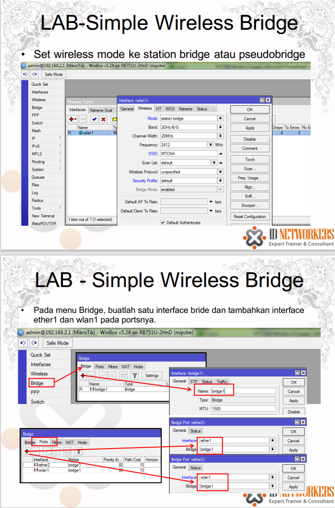

<a href="../../README.md#back">Back README.md...</a>

# bridge
- Menggabungkan 2 atau lebih interface seolah-olah berada dalam 1 segmen network yang sama,
- Bridge juga dapat berjalan pada jaringan wireless
- Proses bridge berjalan pada layer data link (layer 2)
- Interface bridge adalah interface virtual, dimana kita dapat membuat sebanyak yang kita inginkan
- Tahap pembuatan bridge adalah, membuat bridge baru dan menambahkan interface fisik kedalam port bridge
- Jika kita membuat interface bride tanpa menambahkan interface fisik pada portnya, maka bridge tersebut dianggap sebagai interface loopback

## Kelemahan dari Bridge adalah
- Sulit untuk mengatur trafik broadcast (misalnya akibat virus, dll)
- Permasalahan pada satu port/segmen akan membuat masalah di port/segmen pada bridge yang sama
- Peningkatan beban trafik akibat terjadinya akumulasi traffic broadcast

## Wireless Bridging
- Semua mode wireless bisa dibridging, kecuali mode station.
-  Mode station tidak dapat di bridging, sehingga diciptakan mode station dengan type lain
- Station bridge adalah fitur MikroTik sejak v5 yang memungkinkan station untuk dibridge.
- Station bridge hanya akan berjalan pada koneksi antar MikroTik (versi 5 keatas)
