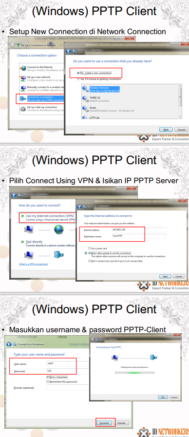
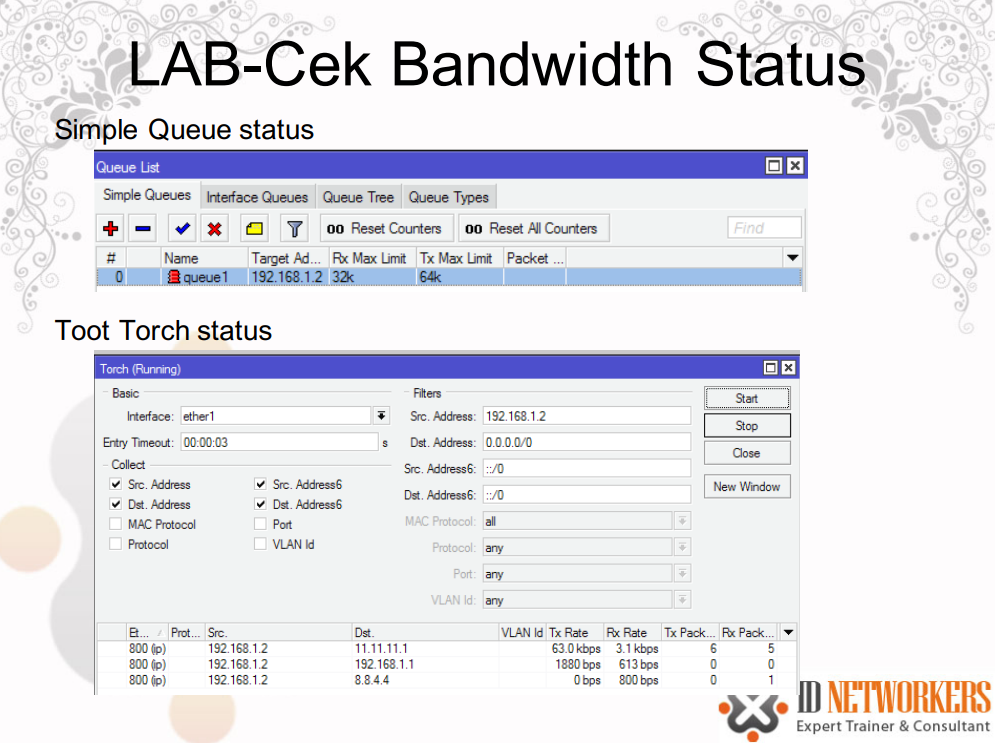

# Static Routing


# Tunnel
- Tunnel adalah sebuah metode penyelubungan (encapsulation) paket data di jaringan.
- Sebelum dikirim, paket data mengalami sedikit pengubahan atau modifikasi, yaitu penambahan header dari tunnel
- Ketika data sudah melewati tunnel dan sampai di tujuan (ujung) tunnel, maka header dari paket data akan dikembalikan seperti semula (header tunnel dilepas).

# VPN
- VPN dibentuk dari beberapa tunnel yang digabung
- VPN adalah sebuah cara aman untuk mengakses local area network dengan menggunakan internet atau jaringan publik.
- Tunnel atau terowongan merupakan kunci utama pada VPN, koneksi pribadi dalam VPN dapat terjadi dimana saja selama terdapat tunnel.


## vpn in mikrotik
- EoIP => Tunnel yang paling sederhana di MikroTik adalah EoIP (Ethetnet over IP)
- PPTP => PPTP melakukan membentuk tunnel PPP antar IP mengunakan protocol TCP dan GRE (Generic Routing Encapsulation).
- L2TP => Layer 2 Tunneling Protocol (L2TP) adalah jenis tunneling & encapsulation lain untuk protocol PPP.
- PPPoE => PPPoE adalah untuk enkapsulasi frame Point-to-Point Protocol(PPP) di dalam frame Ethernet
- SSTP 
- OpenVPN

- PPP => (Point to Point Protocol) adalah protocol layer 2 yang digunakan untuk komunikasi secara serial

# EOIP
- EOIP merupakan protocol proprietary untuk membangun bridge dan tunnel antar router Mikrotik, dimana interface EOIP akan dianggap sebagai ethernet
- Tunnel yang paling sederhana di MikroTik adalah EoIP (Ethetnet over IP)
- EoIP menggunakan encapsulation Generic Routing Encapsulation (IP Protocol No 47)
- EoIP tidak menggunakan ekripsi, jadi tidak disarankan digunakan untuk transmisi data yang membutuhkan tingkat keamanan yang tinggi
- Identifikasi tunnel menggunakan Tunnel ID
- MAC Address diantara interface EOIP harus berbeda


# PPP
- PPP (Point to Point Protocol) adalah protocol layer 2 yang digunakan untuk komunikasi secara serial.
- Untuk menjalankan koneksi PPP, mikrotik RouterOS harus memiliki port/interface serial, line telephone port berupa RJ11 (PSTN), atau modem seluler (PCI atau PCMCIA)
- Untuk terbentuk koneksi PPP dilakukan melalui dial up nomer telepon tertentu ke ISP (misal nomor *99***1#).
- Kemudian ppp baru mendapatkan IP address untuk koneksi internet
- MikroTik dapat digunakan sebagai PPP server dan atau PPP client


## PPTP
- PPTP melakukan membentuk tunnel PPP antar IP mengunakan protocol TCP dan GRE (Generic Routing Encapsulation).
- PPTP secure, karena menggunakan enkripsi MPPE (Microsoft Point-to-Point Encryption) panjang 40 dan 128 bit encrypts
- PPTP menggunakan port TCP 1723
- PPTP banyak digunakan karena hampir semua OS dapat menjalankan PPTP client
- PPTP adalah tunnel tipe client server, dimana PPTP server lebih banyak melalukan konfgurasi untuk setiap client yang ingin konek


### PPP Secret
- Semua koneksi yang menggunkan protocol PPP selalu melibatkan authentikasi username dan password
- Secara local, username dan password ini disimpan dan diatur dalam bagian PPP secret
- Username dan password ini juga dapat disimpan dalam RADIUS server terpisah.
- PPP Secret (database local PPP) menyimpan username dan password yang akan digunakan oleh semua pptp clientnya
- Selain dipakai untuk PPTP client, PPP secret juga dipakai untuk protocol ppp lainya seperti; **async, l2tp, openvpn, pppoe, pptp dan sstp**


### pptp in windows




# L2TP
- Layer 2 Tunneling Protocol (L2TP) adalah jenis tunneling & encapsulation lain untuk protocol PPP
- L2TP mensupport non-TCP/IP protocols (Frame Relay, ATM and SONET).
- L2TP dikembangkan atas kerja sama antara Cisco dan Microsoft untuk menggabungkan fitur dari PPTP dengan protocol proprietary Cisco yaitu protokol Layer 2 Forwarding(L2F)
- L2TP tidak melakukan enkripsi paket, untuk enkripsi biasanya L2TP dikombinasikan dengan IPsec
- L2TP menggunakan UDP port 1701


# PPOE
- PPPoE adalah untuk enkapsulasi frame Point-to-Point Protocol(PPP) di dalam frame Ethernet, 
- PPPoE biasanya dipakai untuk jasa layanan ADSL untuk menghubungkan modem ADSL (kabel modem) di dalam jaringan Ethernet (TCP/IP).
- PPPoE, adalah Point-to-Point, di mana harus ada satu point ke satu point lagi. Lalu, apabila point yang pertama adalah router ADSL kita, lalu di mana point satu nya lagi ?
- Tapi, bagaimana si modem ADSL bisa tahu point satunya lagi apabila kita (biasanya) hanya mendapatkan username dan password dari provider?
- Tahap awal dari PPPoE, adalah PADI ( PPP Active Discovery Initiation ), PADI mengirimkan paket broadcast ke jaringan untuk mencari di mana lokasi Access Concentrator di sisi ISP.

- tahapan:
    1. PADI ( PPP Active Discovery Initiation ), Di sini PPoE client mengirimkan paket broadcast ke jaringan dengan alamat pengiriman mac address FF:FF:FF:FF:FF:FF.
        - PPPoE client mencari di mana lokasi PPoE server dalam jaringan.
    2. PADO (PPPoE Active Discovery Offer). PADO ini merupakan jawaban dari PPoE server atas PADI yang didapatkan sebelumnya. PPPoE server memberikan identitas berupa MAC addressnya.
    3.  PADR ( PPP Active Discovery Request ), merupakan konfirmasi dari PPoE client ke server. Disini PPoE client sudah dapat menghubungi PPoE server menggunakan mac addressnya, berbeda dengan paket PADI yang masih berupa broadcast.
    4. PADS ( PPP Active Discovery Session-confirmation ), dari PPoE server ke client.
        - Session-confirmation di sini memang berarti ada session ID yang diberikan oleh server kepada client. Pada tahap ini juga terjadi negosiasi Username, password dan IP address.
    5. PADT ( PPP Active Discovery Terminate ), bisa dikirim dari server ataupun client, ketika salah satu ingin mengakhiri koneksinya


# QoS (Quality Of Service)
## rate limit
- Pada RouterOS, dikenal 2 jenis batasan rate limit
    - CIR (Committed Information Rate) - dalam keadaan terburuk, client akan mendapatkan bandwidth sesuai dengan “limit-at” (dengan asumsi bandwidth yang tersedia cukup untuk CIR semua client)
    - MIR (Maximal Information Rate)- jika masih ada bandwidth yang tersisa setelah semua client mencapai “limit-at”, maka client bisa mendapatkan bandwidth tambahan hingga “max-limit”.

## Simple Queue
- Pada RouterOS, Bandwidth Limit dapat dilakukan dengan berbagi cara (wireless access list, ppp secret dan hotspot user)
- Simple queue mengatur pembatasan bandwidth dengan hanya mendefinisikan parameter IP address (target address) dari host/koneksi yang dilimit
- Simple queue paling sederhana hanya melakukan pembatasan bandwidth max-limit (MIR)




## PCQ
- PCQ akan membuat sub-queue, berdasarkan parameter pcq-classifier (src-address, dst-address, src-port, dst-port)
- Dimungkinkan untuk membatasi maksimal data rate untuk setiap sub queue (pcq-rate) dan jumlah paket data (pcq-limit)
- Total ukuran queue pada PCQ-sub queue tidak bisa melebihi jumlah paket sesuai pcq-total-limit


# network management
## ARP
- Meskipun pengalamatan paket data menggunakan alamat IP, alamat hardware/hardware address harus digunakan untuk transport data host to host pada connected network. 
- ARP digunakan untuk mapping layer OSI level 3 (IP) ke layer OS level 2 (MAC Address).
- Router memiliki tabel entri ARP saat ini digunakan,
biasanya tabel ARP dibuat secara dinamis oleh router,
tetapi untuk meningkatkan keamanan jaringan, dapat juga dibuat secara statis baik sebagian atau semuanya dengan menambahkan secara manual pada entri ARP tabel.

## Interface ARP Mode
- **Enable** => Mode ini default enable pada semua interface di MikroTik. Semua ARP akan ditemukan dan secara dinamik ditambahkan dalam ARP tabel
- **Reply Only** => ARP reply-only memungkinkan router hanya kan mereply ARP statis ditemukan di tabel ARP, 
    - akses ke router dan ke jaringan di belakang router hanya dapat diakses oleh kombinasi Ip dan mac address yang ditemukan di tabel ARP.
- **Disable** => permintaan ARP dari klien tidak dijawab oleh router. 
    - Oleh karena itu, statis arp entri harus ditambahkan disamping disisi router juga disisi client. misal pada Windows menggunakan perintah arp:
    ```
    C: \> arp-s 192.168.2.1 00-aa-00-62-c6-09
    ```
- **Proxy ARP** => Router dengan mode ARP proxy akan bertindak sebagai transparan proxy ARP antara dia atau lebih jaringan yang terhubung langsung


## dhcp server
