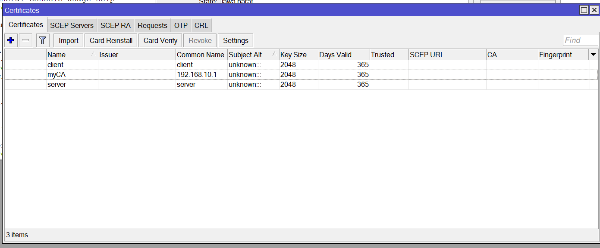
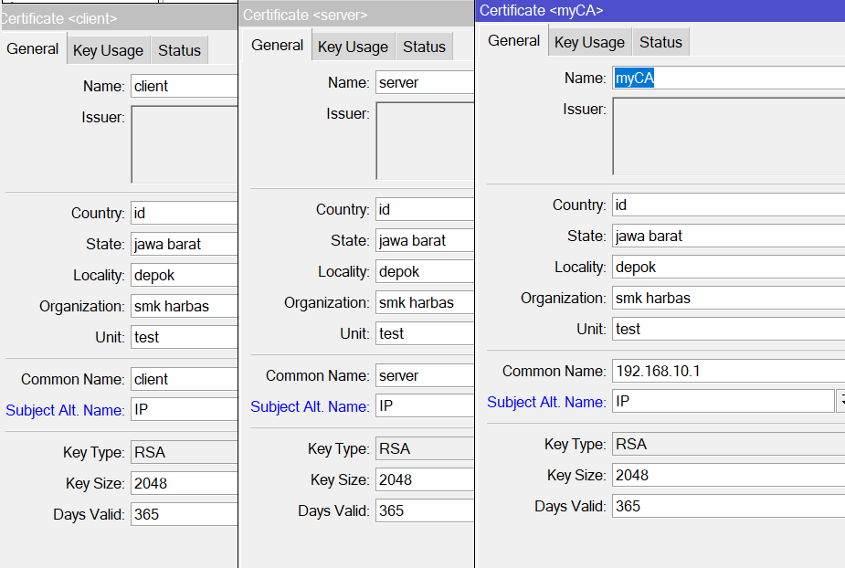
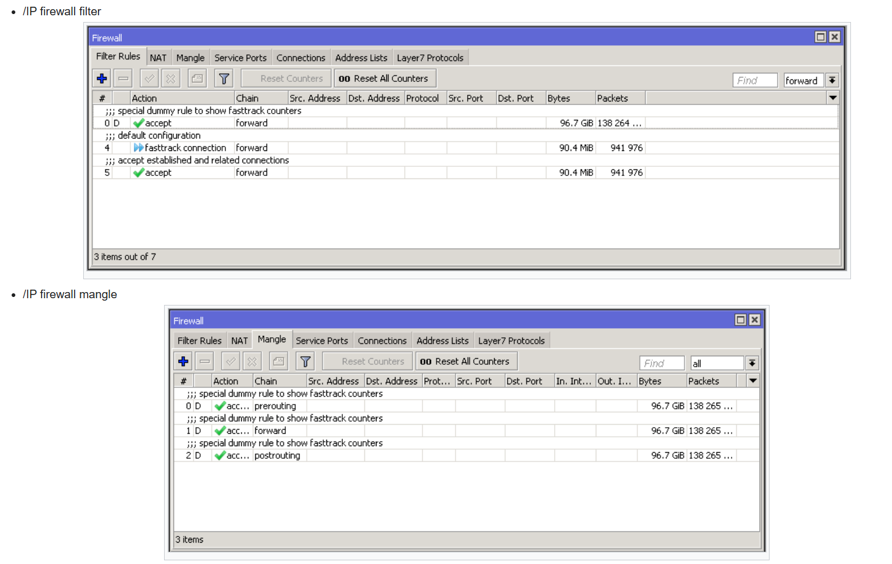
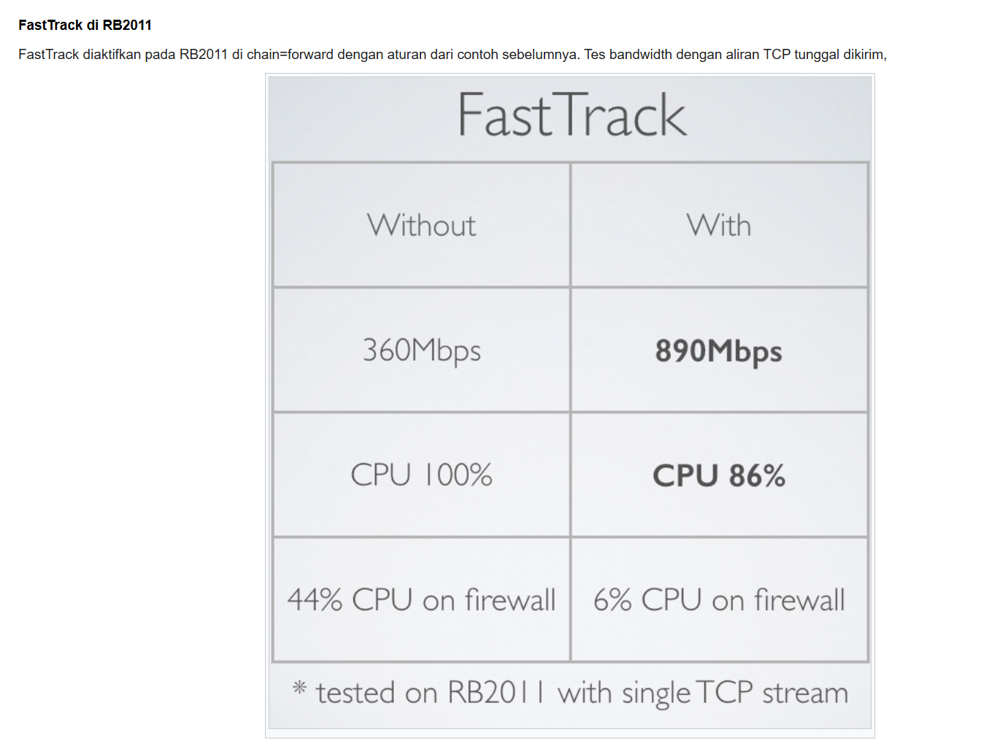
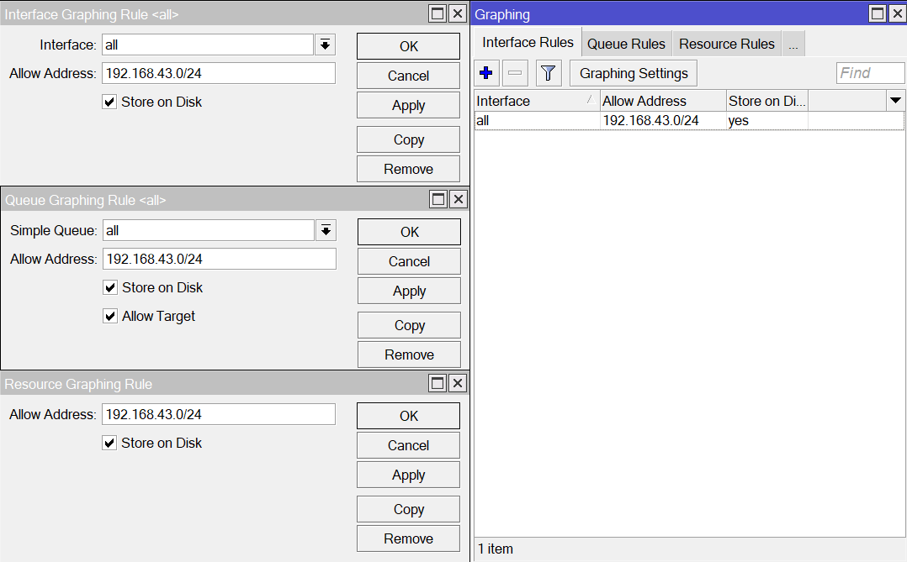
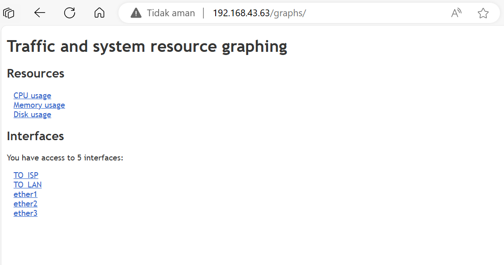
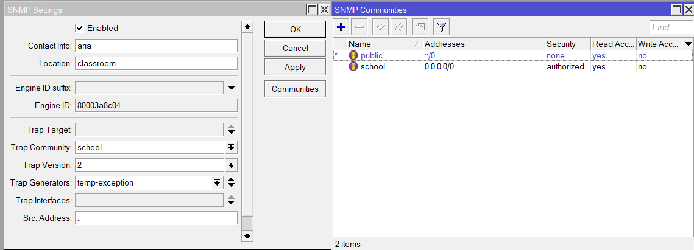
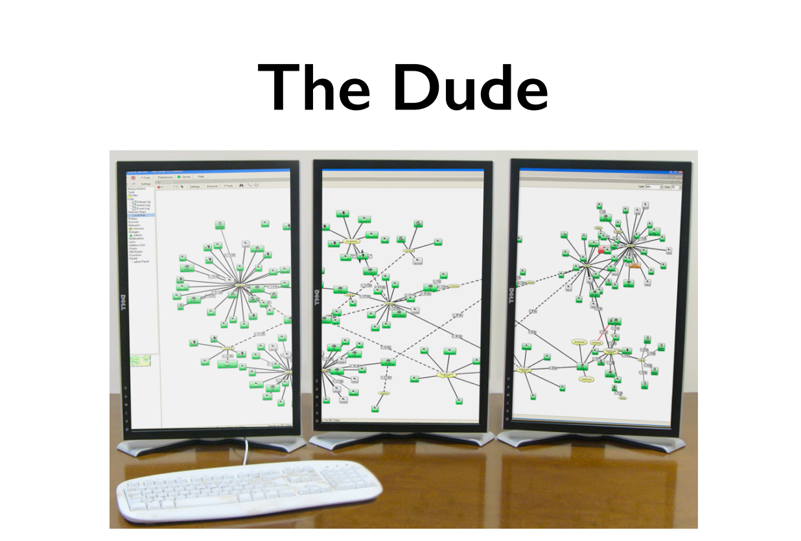
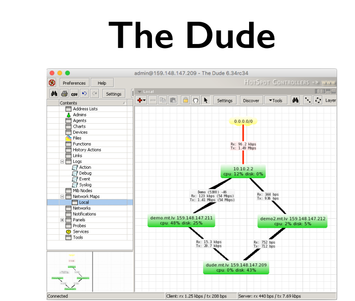

### seharusnya nama ininyaa paake template terlebnih dahulu

```bash
# KLAT => private key, crl, authoritative, trusted
certificate sign myCA ca-crl-host=192.168.10.1 name=<nama_cert_jika_ingin_diganti>

# KA => private key, authoritative
certificate sign server ca=myCA name=server
certificate sign client ca=myCA name=client

# KAT => private key, authoritataive, trusted
certificate set trusted=yes server
certificate set trusted=yes client

# export
certificate export-certificate myCA export-passphrase=ariafatah
certificate export-certificate client export-passphrase=ariafatah
```

# fasttrack
```
/ip firewall filter add chain=forward action=fasttrack-connection connection-state=established,related
/ip firewall filter add chain=forward action=accept connection-state=established,related
```



# kirim script to email
```sh
export file=export 
/tool e-mail send to=you@gmail.com\ 
 subject="$[/system identity get name] export"\
 body="$[/system clock get date]\ 
 configuration file" file=export.rsc
```

# grapsh
- graphs add 

- open in http://192.168.43.63/graphs/


# snmp
- Simple Network Management Protocol (SNMP)
- Used for monitoring and managing devices
- RouterOS supports SNMP v1, v2 and v3
- SNMP write support is available only forsome settings
- default comunity is public


# The Dude
- Application by MikroTik which can dramatically improve the way you manage your network environment
- Automatic discovery and layout map of devices
- Monitoring of services and alerting
- Free of charge
- Supports SNMP, ICMP, DNS and TCP  monitoring
- Server part runs on RouterOS (CCR, CHR  or x86)
- Client on Windows (works on Linux and  OS X using Wine)


- Download the Dude client for Windows from mikrotik.com/download page
- Install and connect to MikroTik Dude demo server: dude.mt.lv 
- Observe the Dude
